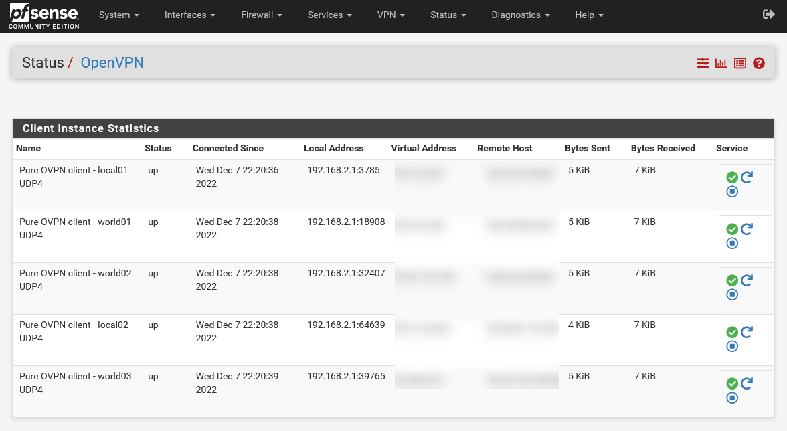
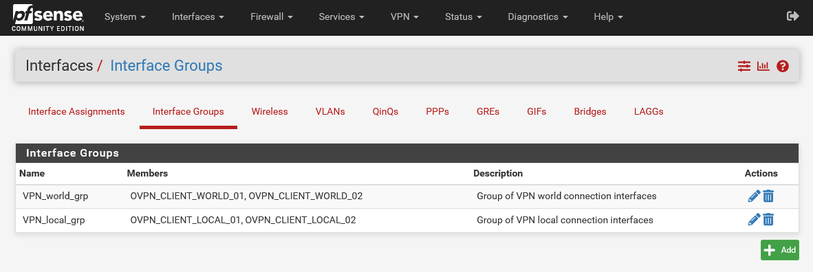
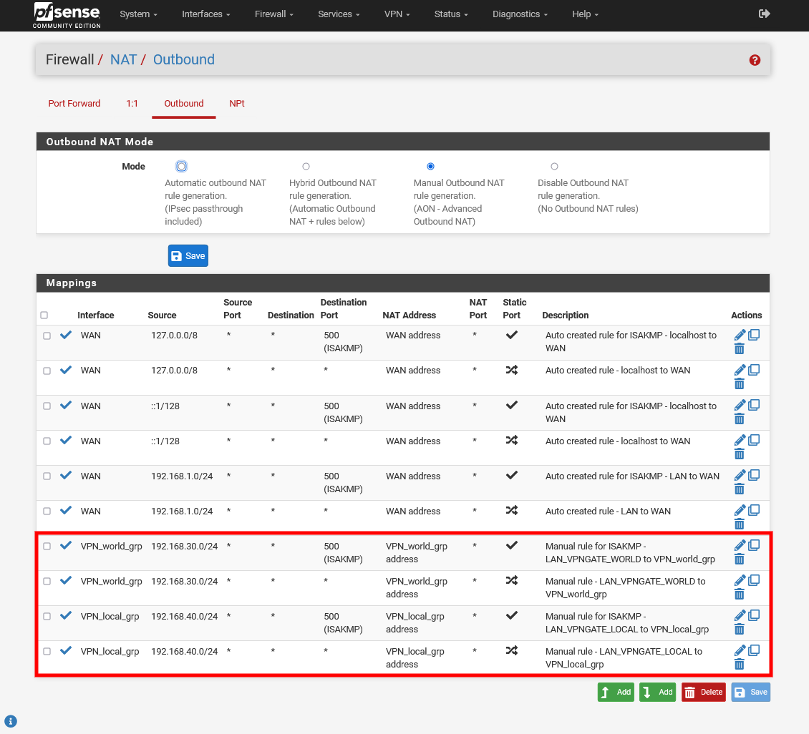
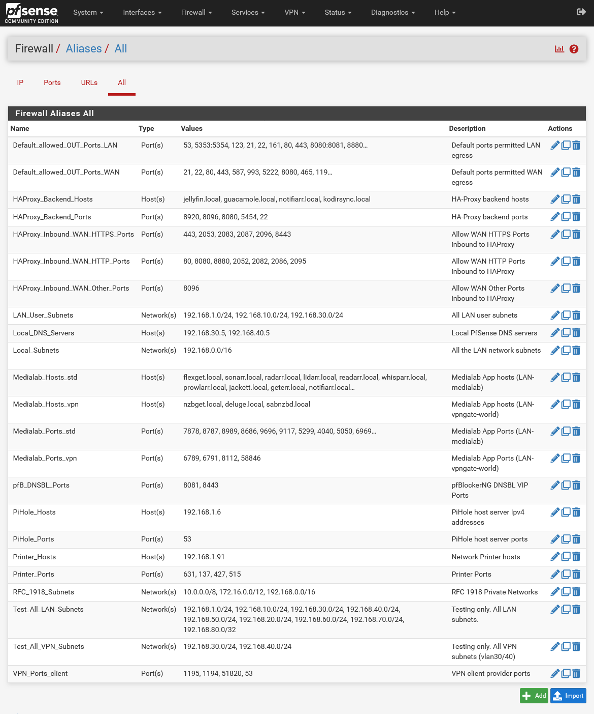

<h1>PVE pfSense VM</h1>

This guide provides instructions for setting up and configuring a PVE pfSense VM with OpenVPN or WireGuard VLAN Gateways in a UniFi network environment. To implement this setup, you will need a Layer 3 LAN network.

Here are the two VLANs that you will be configuring:

* `LAN-vpngate-world` (VLAN30): This VLAN will serve as an OpenVPN gateway pool to your preferred VPN provider's exit points. You can configure the gateway with single or multiple OpenVPN tunnels for redundancy and improved data speed. This gateway is recommended for clients located outside your country or union, providing a safe zone outside your jurisdiction.
* `LAN-vpngate-local` (VLAN40): This VLAN will also function as an OpenVPN gateway pool to your preferred VPN provider's exit points. The gateway can be configured with single or multiple OpenVPN tunnels for redundancy and improved data speed. However, this VPN gateway connects to servers that are local, in-country, or within your union and should provide a faster connection speed than "LAN-vpngate-world".

To configure this installation, you will utilize the pfSense inbuilt `Backup & Restore` function. This process involves importing our pfSense configuration XML file, which will automatically configure your pfSense device with our default settings.

<h2>Prerequisites</h2>

**Network Prerequisites**

- [x] Layer 3 Network Switches
- [x] Network Gateway (*recommend xxx.xxx.xxx.5*)
- [x] Network DHCP server (*recommend xxx.xxx.xxx.5*)
- [x] Network DNS server (*recommend xxx.xxx.xxx.5*)
- [x] Network Name Server
- [x] PiHole CT DNS server. Configured with Conditional Forwarding addresses:
    * Router DNS server (i.e 192.168.1.5 - UniFi DNS)
    * New LAN-vpngate-world DNS Server (i.e 192.168.30.5 - pfSense VLAN30)
    * New LAN-vpngate-local DNS Server (i.e 192.168.40.5 - pfSense VLAN40)
- [x] Local domain name is set on all network devices (*see note below*)
- [x] PVE host hostnames are suffixed with a numeric (*i.e pve-01 or pve01 or pve1*)
- [x] PVE host 2x physical LAN Nics available (LAN & WAN)
- [x] PVE host has internet access

**Required Prerequisites**

- [x] Proxmox node (PVE-01) is configured as per [PVE-HOST-SETUP](https://github.com/ahuacate/pve-host) with 2 or more LAN NICs.
- [x] PVE PiHole CT configured with conditional forwarding for all "LAN-vpngate" networks (i.e DNS/DHCP servers 192.168.30.5 and 192.168.40.5) and your local DNS server (i.e UniFi DNS/DHCP server 192.168.1.5)
- [x] pfSense ISO Version 2.6 or later. Available [here](https://www.pfsense.org/download/)

<h2>Local DNS Records</h2>

Before proceeding, we strongly advise that you familiarize yourself with network Local DNS and the importance of having a PiHole server. To learn more, click <a href="https://github.com/ahuacate/common/tree/main/pve/src/local_dns_records.md" target="_blank">here</a>.

It is essential to set your network's Local Domain or Search domain. For residential and small networks, we recommend using only top-level domain (spTLD) names because they cannot be resolved across the internet. Routers and DNS servers understand that ARPA requests they do not recognize should not be forwarded onto the public internet. It is best to select one of the following names: local, home.arpa, localdomain, or lan only. We strongly advise against using made-up names.

<h4>Table of Contents</h4>

<!-- TOC -->

- [1. Prepare your UniFi network](#1-prepare-your-unifi-network)
    - [1.2. Configure UniFi LAN networks for pfSense](#12-configure-unifi-lan-networks-for-pfsense)
        - [1.2.1. Configure UniFi default network](#121-configure-unifi-default-network)
        - [1.2.2. Configure UniFi WAN network (VLAN2)](#122-configure-unifi-wan-network-vlan2)
        - [1.2.3. Configure UniFi LAN-transit-pfsense network (VLAN3)](#123-configure-unifi-lan-transit-pfsense-network-vlan3)
        - [1.2.4. Configure UniFi LAN-medialab network (VLAN50)](#124-configure-unifi-lan-medialab-network-vlan50)
        - [1.2.6. Configure UniFi LAN-vpngate VLAN-only networks (VLAN30 & VLAN40 - pfSense hosted DHCP & DNS)](#126-configure-unifi-lan-vpngate-vlan-only-networks-vlan30--vlan40---pfsense-hosted-dhcp--dns)
    - [1.4. Configure UniFi Static Routes](#14-configure-unifi-static-routes)
    - [1.3. Assign UniFi switch ports](#13-assign-unifi-switch-ports)
        - [1.3.1. Assign switch port to PVE-LAN](#131-assign-switch-port-to-pve-lan)
        - [1.3.2. Assign switch port to WAN VLAN2](#132-assign-switch-port-to-wan-vlan2)
        - [UniFi Profiles - IP Groups](#unifi-profiles---ip-groups)
        - [UniFi Firewall rules](#unifi-firewall-rules)
- [2. Prepare your Proxmox host](#2-prepare-your-proxmox-host)
- [3. Create a Proxmox pfSense VM](#3-create-a-proxmox-pfsense-vm)
    - [3.1. Download the latest pfSense ISO](#31-download-the-latest-pfsense-iso)
    - [3.2. Create a pfSense VM](#32-create-a-pfsense-vm)
    - [3.3. Start pfSense installer on the new VM](#33-start-pfsense-installer-on-the-new-vm)
- [4. Configure pfSense using our restore file](#4-configure-pfsense-using-our-restore-file)
- [5. Configure pfSense to your network requirements](#5-configure-pfsense-to-your-network-requirements)
    - [5.1. Run pfSense Setup Wizard](#51-run-pfsense-setup-wizard)
- [6. Configure pfSense AES-NI or BSD-Crypto](#6-configure-pfsense-aes-ni-or-bsd-crypto)
- [7. Configure pfSense OpenVPN clients](#7-configure-pfsense-openvpn-clients)
    - [7.1. Add pfSense OpenVPN Client Certificate details](#71-add-pfsense-openvpn-client-certificate-details)
    - [7.2. Create pfSense OpenVPN Client Server(s)](#72-create-pfsense-openvpn-client-servers)
- [8. pfSense Networks and Interfaces](#8-pfsense-networks-and-interfaces)
    - [8.1. LAN-vpngate-world clients](#81-lan-vpngate-world-clients)
- [9. Manual pfSense build](#9-manual-pfsense-build)
- [10. Preventing IP address leaks](#10-preventing-ip-address-leaks)
- [11. General system setup](#11-general-system-setup)
- [12. Configure pfSense interface VLANs](#12-configure-pfsense-interface-vlans)
- [13. Configure pfSense interfaces](#13-configure-pfsense-interfaces)
    - [13.1. Add or Edit interface WAN](#131-add-or-edit-interface-wan)
    - [13.2. Add or Edit interface LAN](#132-add-or-edit-interface-lan)
    - [13.3. Add or Edit interface LAN_transit](#133-add-or-edit-interface-lan_transit)
    - [13.4. Add or Edit LAN_vpngate interfaces](#134-add-or-edit-lan_vpngate-interfaces)
    - [13.5. Add or Edit OpenVPN client interface (ovpnc)](#135-add-or-edit-openvpn-client-interface-ovpnc)
    - [13.6. Configure pfSense Interface Groups](#136-configure-pfsense-interface-groups)
        - [13.6.1. Create Interface Groups for "vpngate-world" & "vpngate-local"](#1361-create-interface-groups-for-vpngate-world--vpngate-local)
- [14. Configure pfSense Gateways](#14-configure-pfsense-gateways)
    - [14.1. Edit WAN Gateway](#141-edit-wan-gateway)
    - [14.2. Create LAN_TRANSIT_DHCP Gateway](#142-create-lan_transit_dhcp-gateway)
- [15. Configure pfSense Routing Gateway Groups](#15-configure-pfsense-routing-gateway-groups)
    - [15.1. Create Gateway_VPN_World_Group](#151-create-gateway_vpn_world_group)
    - [15.2. Create Gateway_VPN_Local_Local](#152-create-gateway_vpn_local_local)
- [16. Configure pfSense Static Routes](#16-configure-pfsense-static-routes)
    - [16.1. Create LAN-medialab static route](#161-create-lan-medialab-static-route)
    - [16.2. Create LAN-homelab static route (optional)](#162-create-lan-homelab-static-route-optional)
- [17. Disable Gateway monitoring](#17-disable-gateway-monitoring)
- [18. Reboot pfSense](#18-reboot-pfsense)
- [19. Configure pfSense DNS Resolver](#19-configure-pfsense-dns-resolver)
    - [19.1. Configure DNS Resolver General Settings](#191-configure-dns-resolver-general-settings)
    - [19.2. Configure DNS Resolver Advanced Settings](#192-configure-dns-resolver-advanced-settings)
    - [19.3. Configure pfSense DHCP Servers](#193-configure-pfsense-dhcp-servers)
- [20. Configure pfSense Firewall NAT rules](#20-configure-pfsense-firewall-nat-rules)
- [21. Configure pfSense Firewall Aliases](#21-configure-pfsense-firewall-aliases)
    - [21.1. Create all pfSense Aliases](#211-create-all-pfsense-aliases)
- [22. Configure pfSense Firewall Rules](#22-configure-pfsense-firewall-rules)
    - [22.1. Create all pfSense Firewall Rules](#221-create-all-pfsense-firewall-rules)
- [23. Setup NTP Service](#23-setup-ntp-service)
- [24. Install pfSense required packages](#24-install-pfsense-required-packages)
    - [24.1. Setup Avahi package](#241-setup-avahi-package)
- [25. Finish Up](#25-finish-up)
- [26. Create a pfSense Backup](#26-create-a-pfsense-backup)
- [27. Patches and Fixes](#27-patches-and-fixes)

<!-- /TOC -->

# 1. Prepare your UniFi network
Our pfSense build requires some network customization. This guide is based on UniFi switches and routers. The UniFi configurations should easily translate to other brands of network hardware.

You should first read our Github UniFi build guide to configure your network: [UniFi Build](https://github.com/ahuacate/unifibuild). This guide illustrates a complete network configuration that supports our pfSense installation.

## 1.2. Configure UniFi LAN networks for pfSense
We use VLANs to separate networks for easier management and to apply security policies. The following networks are the required minimum to support pfSense VPN Vlans.

### 1.2.1. Configure UniFi default network
The first step is to edit your default LAN network configuration.

1. Navigate to `Settings` > `Networks` > `Default`:
-- Network name: default
-- Gateway IP/Subnet: Host address `192.168.1.5`, Netmask `24`, 254 Usable hosts
-- Advanced: Manual
-- IGMP Snooping: enable
-- Multicast DNS: disable
-- DHCP Mode: DHCP Server
-- DHCP Range: 192.168.1.150 - 192.168.1.250
-- Default Gateway: Auto
-- DNS Server: 192.168.1.6, 1.1.1.1 (Note: 192.168.1.6 is PiHole. If no PiHole use 192.168.1.5)
-- Lease Time: 86400
-- Domain Name: local

### 1.2.2. Configure UniFi WAN network (VLAN2)
Create a dedicated VLAN2 network for pfSense WAN only (labeled VPN-egress). All pfSense VPN traffic will exit pfSense on WAN VLAN2. For added security, we assign VLAN2 Guest status.

1. Navigate to `Settings` > `Networks` > `Default`:
-- Network name: VPN-egress
-- Gateway IP/Subnet: Host address `192.168.2.5`, Netmask `28`, 14 Usable hosts
-- Advanced: Manual
-- VLAN ID: 2
-- Isolation: enable
-- Network Group: LAN
-- IGMP Snooping: enable
-- Multicast DNS: disable
-- DHCP Mode: DHCP Server
-- DHCP Range: 192.168.2.1 - 192.168.2.14
-- Default Gateway: Auto
-- DNS Server: Auto
-- Lease Time: 86400
-- Domain Name: local

### 1.2.3. Configure UniFi LAN-transit-pfsense network (VLAN3)
Here we configure an uplink between the UniFi switch to the pfSense LAN interface. This can be referred to as a “Transit” network for traffic between the two devices.

1. Navigate to `Settings` > `Networks` > `Default`:
-- Network name: LAN-transit-pfsense
-- Gateway IP/Subnet: Host address `192.168.3.5`, Netmask `28`, 14 Usable hosts
-- Advanced: Manual
-- VLAN ID: 3
-- Isolation: disable
-- Network Group: LAN
-- IGMP Snooping: enable
-- Multicast DNS: disable
-- DHCP Mode: DHCP Server
-- DHCP Range: 192.168.3.1 - 192.168.3.14
-- Default Gateway: Auto
-- DNS Server: Auto
-- Lease Time: 86400
-- Domain Name: local

### 1.2.4. Configure UniFi LAN-medialab network (VLAN50)
LAN-medialab is vlan50 which is the network for all media-related clients and servers. We require this network because pfSense firewall rules must allow media management clients, such as Radarr and Sonarr, to communicate with download clients on the VPN gateway VLANs.

1. Navigate to `Settings` > `Networks` > `Default`:
-- Network name: LAN-medialab
-- Gateway IP/Subnet: Host address `192.168.50.5`, Netmask `24`, 254 Usable hosts
-- Advanced: Manual
-- VLAN ID: 50
-- Isolation: disable
-- Network Group: LAN
-- IGMP Snooping: enable
-- Multicast DNS: enable
-- DHCP Mode: DHCP Server
-- DHCP Range: 192.168.50.150 - 192.168.50.250
-- Default Gateway: Auto
-- DNS Server: Auto
-- Lease Time: 86400
-- Domain Name: local

### 1.2.6. Configure UniFi LAN-vpngate VLAN-only networks (VLAN30 & VLAN40 - pfSense hosted DHCP & DNS)
Both new "LAN-vpngate-world" and "LAN-vpngate-local" networks are hosted on pfSense including DHCP and DNS. On UniFi you only need to create two matching VLAN-only networks.

1. Navigate to `Settings` > `Networks` > `Default`:
-- Network name: LAN-vpngate-world
-- Router: Third-party Gateway
-- VLAN ID: 30
-- IGMP Snooping: enable
-- DHCP Guarding: disable
2. Navigate to `Settings` > `Networks` > `Default`:
-- Network name: LAN-vpngate-local
-- Router: Third-party Gateway
-- VLAN ID: 40
-- IGMP Snooping: enable
-- DHCP Guarding: disable

## 1.4. Configure UniFi Static Routes
Create the following static routes for your two "vpngate" networks.

1. Navigate to `Settings` > `Routes` > `Create Entry`:
-- **vpngate-world**
-- Name: Route access to VLAN30
-- Distance: 1
-- Destination Network: 192.168.30.0/24
-- Type: `☑` Next Hop
-- Next Hop: 192.168.3.1
2. Navigate to `Settings` > `Routes` > `Create Entry`:
-- **vpngate-local**
-- Name: Route access to VLAN40
-- Distance: 1
-- Destination Network: 192.168.40.0/24
-- Type: `☑` Next Hop
-- Next Hop: 192.168.3.1

## 1.3. Assign UniFi switch ports
In UniFi you must assign the 2x physical LAN cables connecting your UniFi switch to your Proxmox host or pfSense device with a UniFi Port Profile. Both LAN and WAN connections must be identified.

For cable management purposes, I dedicate switch ports 1-6 to my Proxmox cluster.

### 1.3.1. Assign switch port to PVE-LAN
Navigate to `Ports` > `Ports Tab` and then select the switch port that is physically connected and assigned to Proxmox host or pfSense as LAN.

My Proxmox and pfSense "LAN" is a port aggregate of UniFi NIC ports 1 & 2 which is not a requirement.

What important is the UniFi `Port Profile` of your selected NIC port must be assigned as `All`.

### 1.3.2. Assign switch port to WAN VLAN2
Navigate to `Ports` > `Ports Tab` and then select the switch port that is physically connected and assigned to pfSense as WAN (VPN-egress).

My pfSense "WAN" is a port aggregate of UniFi NIC ports 3 & 4 which is not a requirement.

What important is the UniFi `Port Profile` of your selected NIC port must be assigned as `VPN-egress`.

### UniFi Profiles - IP Groups
You should create all your Profile `Groups` before creating firewall rules. Apply all the relevant profiles from our [UniFi Build](https://github.com/ahuacate/unifibuild) guide.

### UniFi Firewall rules
Apply all the relevant firewall from our [UniFi Build](https://github.com/ahuacate/unifibuild) guide.

# 2. Prepare your Proxmox host
Your Proxmox hosts must have 2x configured Network Linux Bridges for pfSense to work. Amend the IP addresses to suit your network subnets.

| Name | IPv4/CIDR | Gateway | VLAN aware
| :---  | :--- | :--- | :---
| vmbr0 | 192.168.1.101/24 | 192.168.1.5 | :white_check_mark:
| vmbr2 |||:white_check_mark:

# 3. Create a Proxmox pfSense VM
Our pfSense machine is hosted on Proxmox. You could also install pfSense on any x86 hard metal machine with 2x LAN NICS.

## 3.1. Download the latest pfSense ISO
Use the Proxmox WebGUI to add the latest pfSense installation ISO which is available from [HERE](https://www.pfsense.org/download/). Upload the latest pfSense ISO file to Proxmox.

## 3.2. Create a pfSense VM
Navigate using the Proxmox PVE-01 web interface to  (should be https://192.168.1.101:8006/ ) `pve-01` > `Create VM` and fill out the details as shown below (whats not shown below leave as default)

| General | Value 
| :---  | :--- |
| Node |`pve-01`
| VM ID | `253`
| Name | `pfsense` |
| Start at Boot | `☑` Enabled
| Start/Shutdown order | `1`
| Startup delay | `120`
| Startdown timeout | `60`
| Resource Pool | Leave blank
| **OS**
| Use CD/DVD disc image file (ISO) | `pfSense-CE-2.x.x-RELEASE-amd64.iso`
| Guest OS 
| Type | `Other`
| **System**
| Graphic card | `Default`
| Machine | `Default (i440fx)` Qemu Agent `☐` 
| BIOS | `Default (SeaBIOS)` Add TPM `☐`
| SCSI Controller | `VirtIO SCSI`
| **Disks**
| Bus/Device | `IDE 0`
| Storage | `local-lvm` or `local-zfs`
| Disk size (GiB) | `32`
| Cache | `Default (No Cache)`
| Discard | `☐`
| SSD emulation | `☐`
| Async IO | `Default (io_uring)`
| **CPU**
| Sockets | `1`
| Cores | `1`
| Type | `host`
| CPU units | `1024`
| Enable NUMA | `☐`
| **Memory**
| Memory (MiB) | `4096`
| Minimum Memory (MiB) | `4096`
| Ballooning Device | `☑` Enabled
| **Network**
| Bridge | `vmbr0`
| VLAN Tag | `no VLAN`
| Model | `VirtIO (paravirtualized)`
| MAC Address | `auto`
| **Confirm**
| Start after created | `☐` Disabled

1. Navigate using the Proxmox web interface to `pve-01` > `253 (pfsense)` > `Hardware` > `Add` > `Network Device` create the following additional network bridges as shown below:
-- Bridge: **`vmbr2`** (WAN)
-- VLAN Tag: `no VLAN`
-- Model: `VirtIO (paravirtualized)`

Your PVE `pfSense` > `hardware` network setup should be exactly as shown below. Make sure the "Network Devices" are correctly assigned assigned to the matching WAN and LAN Nic ports. This is VERY IMPORTANT.

## 3.3. Start pfSense installer on the new VM
Navigate using the Proxmox PVE-01 web interface to (should be https://192.168.1.101:8006/ ) `pve-01` > `253 (pfsense)` > `Start`. When running click on the VM `>_Console` tab and you should see the installation script running. Follow the prompts and fill out the details as shown below.

| pfSense Installation Step | Value | Notes
| :--- | :--- | :---
| Copyright and distribution notice | `Accept` 	
| Welcome to pfSense / Install pfSense | `<OK>` 	
| Keymap Selection / >>> Continue with default keymap | `<Select>` 	
| Partitioning / Auto (UFS) BIOS - Guided Disk Setup | `<OK>`	
| Manual Configuration | `<No>` 	
| Complete | `<Reboot>` 	
| **The reboot phase**		
| Should VLANs be setup now? | `n` 	
| Enter the WAN interface name or 'a' for auto-detection | `vtnet1` | Double check here. Make sure you select the WAN interface.
| Enter the LAN interface name or 'a' for auto-detection | `vtnet0`	
| Do you want to proceed [y:n] |`y`	

At this stage use the pfSense web interface to complete the installation. Navigate using your web browser to the pfSense LAN interface IPv4 address shown on the terminal screen. In my case the URL was `192.168.1.1`.

Ignore all the web browser security warnings. Click `Accept the Risk and Continue`. Your user credentials are:
* Username - admin  
* Password - pfsense

Do NOT complete the pfSense wizard!

# 4. Configure pfSense using our restore file
pfSense has a inbuilt `Backup & Restore` function. To configure your pfSense we import our custom pfSense configuration XML file. This file will configure all of the following:
* System Interfaces
* System VLANs
* System Routing
* Static Routes
* Firewall Aliases
* Firewall NAT
* Firewall Rules
* Avahi
* DHCP Servers
* DNS Resolver
* Pre-install ExpressVPN Certs
* OpenVPN clients (LAN-vpngate-world and LAN-vpngate-local : preset to use PureVPN)
* and more.

Download our "all" configuration file from Github and save to your local computer.
* https://github.com/ahuacate/pfsense-setup/blob/main/restore/pfsense.all.xml

Experienced users can make edits directly in the `pfsense.all.xml` file to customize your values before importing into pfSense.

1. Navigate using the pfSense web interface to `Diagnostics` > `Backup & Restore` and at the `Restore Backup` section input the following:
-- Restore Backup: Value
-- Restore area: All
-- Configuration file: `Browse`, Select filename: `pfsense.all.xml`
-- Encryption: `☐` Configuration file is encrypted.

Your pfSense machine will reboot with Ahuacate configuration presets. Login details shown in the next step.

# 5. Configure pfSense to your network requirements
The downside is your pfSense uses our default network IP addresses. If you use the 192.168.1.0/24 subnet range and your network router gateway is 192.168.1.5 you have little to edit or change.

You can now access the pfSense webConfigurator by opening the following URL in your web browser: http://192.168.1.253/ (or whatever IP you set in the VM)

Your user credentials are:
* Username - admin  
* Password - pfsense

## 5.1. Run pfSense Setup Wizard
Only configure whats shown below in pfSense.

1. Navigate to `System` > `Setup Wizard`:
-- **Step 1 - Welcome**	
-- Netgate® Global Support is available 24/7: `>>Next`
-- **Step 2 - General information**
-- Hostname: `pfSense`
-- Domain: `local` ("local" is our default for our network. This domain must match all other network devices.)
-- Primary DNS Server: `192.168.1.5` (UniFi UGS/UDM/router IP address.)
-- Secondary DNS Server: `192.168.1.6` (Required. PiHole IP address. Using PiHole alleviates so many headaches.)
-- Override DNS: `☐` Disabled
-- **Step 3 - Time Server Information**
-- Time server hostname: `2.pfsense.pool.ntp.org`
-- Timezone: Select your timezone
-- **Step 4 - Configure WAN Interface**
-- Select Type: `Static`
-- MAC Address: Leave blank
-- MTU: Leave blank
-- MSS: Leave blank
-- IP Address: 192.168.2.1 (This must be VLAN2. Amend to your network subnet (i.e 10.0.2.1). This is the guest network you configured on your UniFi UGS/UDM/router.)
-- Subnet Mask: `28`
-- Upstream Gateway : `192.168.2.5` (This must be VLAN2. Amend to your network subnet (i.e 10.0.2.5). This is the guest VPN-egress network you configured on your UniFi UGS/UDM/router.)
-- **Step 5 - Configure LAN Interface**
-- LAN IP Address: `192.168.1.253` (This is our recommended default IP only.)
-- Subnet Mask: `24`
-- **Step 6 - Set Admin WebGUI Password**
-- Admin Password: Enter your password
-- Admin Password AGAIN: Enter your password
-- **Step 7 - Reload configuration**
-- Reload configuration| `>>Reload`
-- **Step 8 - Wizard completed**
-- Wizard completed: `Finish`

`Accept` the pfSense terms and you have completed this task.

You can now access the pfSense webConfigurator by opening the following URL in your web browser: http://192.168.1.253/ or whatever IP you just set.

# 6. Configure pfSense AES-NI or BSD-Crypto
If your CPU supports AES-NI or AES-NI/BSD-Crypto CPU Crypto enable it. Without crypto acceleration enabled your OpenVPN connections will be slow.

1. Navigate to `System` > `Advanced` > `Miscellaneous Tab` scroll down to the section `Cryptographic & Thermal Hardware`:
-- Cryptographic & Thermal Hardware: `Value`
-- Cryptographic Hardware: `AES-NI CPU-based Acceleration` (Select whats appropriate for your CPU hardware. For any reasonable OpenVPN throughput speed your CPU should be at least AES-NI ready.)
-- Thermal Sensors: `None/ACPI` (Will not work when pfSense is virtualized. Proxmox virtualization host will NOT forward CPU temperature data to it's pfSense guest.)

# 7. Configure pfSense OpenVPN clients
Our pfSense 'restore all build' is pre-configured with OpenVPN clients (ExpressVPN and PureVPN which is enabled). If don't have a VPN provider maybe consider ExpressVPN, NordVPN or Mullvad.

PureVPN is super cheap - our restore all preset. The PureVPN 5yr subscription is as low $80 USD. PureVPN works for Usenet and P2P but not much else. I would not recommend PureVPN for anything beyond Usenet or P2P downloading.

* ExpressVPN, NordVPN or Mullvad (Mullvad for true obfuscating) 
* PureVPN

Or buy me a beer using my referral: [Click here for a ExpressVPN account](https://www.expressrefer.com/refer-a-friend/30-days-free?referrer_id=13665833&utm_campaign=referrals&utm_medium=copy_link&utm_source=referral_dashboard).

For ExpressVPN and PureVPN you can edit the providers client presets `Authentication Settings` username and password credentials and it should work out of the box. Navigate using the pfSense web interface to `VPN` > `OpenVPN` > `Clients` and perform your client edits. Remember to disable any client you are not using and enable what you are using.

If you use another VPN service provider then read-on.

Configuring a OpenVPN client is particular to your VPN provider. You will need your VPN account server username and password details and have your VPN server provider OVPN configuration file open in a text editor so you can copy various certificate and key details (cut & paste). Note the values for this form will vary between different VPN providers but there should be a tutorial showing your providers pfSense configuration settings on the internet somewhere. 

We recommend you complete the configuration of 1x OpenVPN client, test it then duplicate it and edit the particulars.

It is important you give each OpenVPN client a unique descriptive name. My OpenVPN client naming convention is:

| VPN Client Description Name
| :---
| **vpngate-world** - For clients like NZBGet, Deluge where the vpn servers randomly connect in chosen nations.
| `<Provider Name> OVPN client - world01`
| `<Provider Name> OVPN client - world02`
| `<Provider Name> OVPN client - world03` (optional)
| **vpngate-local** - Main household VPN where the vpn servers connect in the region.
| `<Provider Name> OVPN client - local01`
| `<Provider Name> OVPN client - local02`

Later you have the choice to enabling load balancing or redundancy on 'vpngate-world' and 'vpngate-local' VPN clients. You can configure any number of OpenVPN clients, it’s completely your choice.

## 7.1. Add pfSense OpenVPN Client Certificate details
Fill up the necessary fields as follows.

1. Navigate to `System` > `Cert. Manager` > `CAs` > `Add`:
-- Descriptive name: `ExpressVPN` (Or whatever your providers name is, ExpressVPN, PIA etc)
-- Method: `Import an existing Certificate Authority`
-- **Existing Certificate Authority**
-- Certificate data: `Insert your key data` (Open the OpenVPN configuration file that you downloaded and open it with your favorite text editor. Look for the text that is wrapped within the <ca> portion of the file. Copying the entire string from —–BEGIN CERTIFICATE—– to —–END CERTIFICATE—–)
-- Certificate Private Key (optional): Leave this blank
-- Serial for next certificate: Leave this blank

2. Navigate to `System` > `Cert. Manager` > `Certificates` > `Add`:
-- Descriptive name: `ExpressVPN Cert` (Or whatever your providers name is, PIA Cert etc)
-- **Import Certificate**
-- Certificate data: `Insert your key data` (Open the OpenVPN configuration file that you downloaded and open it with your favorite text editor. Look for the text that is wrapped within the <cert> portion of the file. Copy the entire string from —–BEGIN CERTIFICATE—– to —–END CERTIFICATE—–)
-- Private key data: `Insert your key data` (With your text editor still open, look for the text that is wrapped within the <key> portion of the file. Copy the entire string from —–BEGIN RSA PRIVATE KEY—– to —-END RSA PRIVATE KEY—-)

Click `Save`.

## 7.2. Create pfSense OpenVPN Client Server(s)
Navigate using the pfSense web interface to `VPN` > `OpenVPN` > `Clients Tab` > `Add` to open a configuration form, then fill up the necessary fields as follows.  Create one each OVPN client:

* `<Provider name> OVPN client - world01`
* `<Provider name> OVPN client - world02`
* `<Provider name> OVPN client - world03` (optional)
* `<Provider name> OVPN client - local01`
* `<Provider name> OVPN client - local02`

Best create one entry, test the OpenVPN client connects and if succesful use the 'Copy icon' function. Then edit name and Server host or address fields of the copied client.

Next navigate using the pfSense web interface to `Status` > `OpenVPN` and check the Status field for `<Provider name> OVPN client - world01` or `<Provider name> OVPN client - local01`. It should should show `up`. This means you are connected to your VPN provider. If so, you edit or create another OpenVPN client using the same values changing only the `Description` and `Server Host Address` fields to create clients to different location.

# 8. pfSense Networks and Interfaces
If you configured your network in accordance to our guides then your network will resemble the table below.

Highlighted in bold are the mandatory networks and DNS servers required by pfSense. Your new pfSense device should work out-of-the-box.

| Network | Gateway | Name
| :---  | :--- | :---
| 192.168.1.0/24 | 192.168.1.5 | **Default**
| 192.168.2.0/28 | 192.168.2.5 | **VPN-egress**
| 192.168.3.0/248 | 192.168.3.5 | **LAN-transit-pfsense**
| 192.168.10.0/24 | 192.168.10.5 | LAN-open
| 192.168.20.0/24 | 192.168.20.5 | LAN-smart
| 192.168.30.0/24 | 192.168.30.5 | **LAN-vpngate-world** (VLAN-only)
| 192.168.40.0/24 | 192.168.40.5 | **LAN-vpngate-local** (VLAN-only)
| 192.168.50.0/24 | 192.168.50.5 | **LAN-medialab**
| 192.168.60.0/24 | 192.168.60.5 | LAN-vpnserver
| 192.168.70.0/24 | 192.168.70.5 | LAN-guest
| 192.168.80.0/24 | 192.168.80.5 | LAN-homelab
| 192.168.110.0/24 | 192.168.110.5 | LAN-IoT
| 192.168.120.0/24 | 192.168.120.5 | LAN-NoT
| **Network DNS servers**
| 192.168.1.5 | 192.168.1.5 | **UniFi UGS/UDM** (router)
| 192.168.1.6 | 192.168.1.5 | **PiHole**

If you use different subnets and VLANs then proceed to the next step.

## 8.1. LAN-vpngate-world clients
When installing download clients such as NZBGet or Deluge use the LAN-vpngate-world network (VLAN30). Unfortunately due to the restricted nature of UniFi DNS environment you must assign a static dhcp reservation in pfSense for each of these clients.

Start your NZBget or Deluge clients. Navigate using the pfSense web interface to `Status` > `DHCP Leases` > `Leases`. Scroll down to the client (NZBGet or Deluge) and `Actions` category click the `+` Add Static Mapping icon to set a static device IPv4 address.

# 9. Manual pfSense build
If you use different network subnets other than `192.168.1.0/24` or different WAN and LAN-TRANSIT VLANs then must make many IP addresses and VLAN edits throughout pfSense settings.

The rest of this guide was valid at the time of posting. Pay attention to IP addresses, FQDN and VLAN settings as they must match or meet your router configuration.

# 10. Preventing IP address leaks
This is an important step required to reduce the chance of leaks in the event the VPN goes down for any reason. Scroll down to Gateway Monitoring and set the following.

1. Navigate to `System` > `Advanced` and `Miscellaneous Tab`:
-- **Gateway Monitoring**
-- State Killing on Gateway Failure: `☐` Flush all states when a gateway goes down
-- Skip rules when gateway is down: `☑` Do not create rules when gateway is down

# 11. General system setup
Check and set the following.

1. Navigate to `System` > `General Setup`:
-- Hostname: `pfSense`
-- Domain: `local` (*The network Local Domain or Search domain must be set. We recommend only top-level domain (spTLD) names for residential and small networks names because they cannot be resolved across the internet. Routers and DNS servers know, in theory, not to forward ARPA requests they do not understand onto the public internet. It is best to choose one of our listed names: local, home.arpa, localdomain or lan only. Do NOT use made-up names.*)
-- **DNS Server Settings**
-- DNS Server1: `192.168.1.5` (Set to your network DNS router (i.e UniFi UGS/UDM))
-- DNS Server2: `192.168.1.6` (PiHole address)
-- DNS Server Override: `☐` Allow DNS server...
-- DNS Resolution Behavior: `Use local DNS (127.0.0.1), fall back to remote DNS Servers (Default)`
-- **Localization**
-- Timezone: `Europe/Vienna`
-- Skip rules when gateway is down: `☑` Do not create rules when gateway is down

# 12. Configure pfSense interface VLANs
You require 3x new VLANS: LAN-vpngate-world, LAN-vpngate-local and LAN-transit.

Fill out the necessary fields as follows. Make sure the parent interface is your pfSense LAN.

1. Navigate to `Interfaces` > `VLANs` > `+Add/Edit`:
-- Parent Interface: `vtnet0(xx:xx:xx:xx:xx:xx)-lan`
-- VLAN Tag: `30`
-- VLAN Priority: leave blank
-- Description: `LAN-vpngate-world`
1. Navigate to `Interfaces` > `VLANs` > `+Add/Edit`:
-- Parent Interface: `vtnet0(xx:xx:xx:xx:xx:xx)-lan`
-- VLAN Tag: `40`
-- VLAN Priority: leave blank
-- Description: `LAN-vpngate-local`
1. Navigate to `Interfaces` > `VLANs` > `+Add/Edit`:
-- Parent Interface: `vtnet0(xx:xx:xx:xx:xx:xx)-lan`
-- VLAN Tag: `3`
-- VLAN Priority: leave blank
-- Description: `LAN-transit`

# 13. Configure pfSense interfaces
Your number of available interfaces will vary depending on the available LAN NICs and configured VPN clients (i.e `OVPN Client - local01` plus `OVPN Client - local01`).

This guide assumes its a new clean pfSense build. Add or edit the necessary fields to match our guide.

## 13.1. Add or Edit interface WAN

1. Navigate to `Interfaces` > `Assignments` open a existing Interface or click `+add`:
-- Interface: WAN (vtnetX)
-- Enable: `☑`
-- Description: `WAN`
-- IPv4 Configuration Type: `Static IPv4`
-- Ipv6 Configuration Type: `None`
-- MAC Address: Leave blank
-- MTU: Leave blank
-- MSS: Leave blank
-- Speed and  Duplex: `Default (no preference, typically auto-select)`
-- **Static IPv4 Configuration**
-- IPv4 Address: `192.168.2.1/28`
-- IPv4 Upstream gateway: `WANGW - 192.168.2.5` (Click `Add a new Gateway` and create the new gateway, then select it)
-- **Add New IPv4 Gateway**
-- Default: `☑` Default gateway
-- Gateway Name |`WANGW`
-- Gateway IPv4: `192.168.2.5`
-- Description: `WAN/VPN Egress Gateway` (And click `Save` to create the new gateway)
-- **Reserved Networks**
-- Block private networks and loopback addresses: `☐`
-- Block bogon networks: `☐`

## 13.2. Add or Edit interface LAN
1. Navigate to `Interfaces` > `Assignments` open a existing Interface or click `+add`:
-- Interface: LAN (vtnetX)
-- Enable: `☑`
-- Description: `LAN`
-- IPv4 Configuration Type: `Static IPv4`
-- Ipv6 Configuration Type: `None`
-- MAC Address: Leave blank
-- MTU: Leave blank
-- MSS: Leave blank
-- Speed and  Duplex: `Default (no preference, typically auto-select)`
-- **Static IPv4 Configuration**
-- IPv4 Address: `192.168.1.253/24`
-- IPv4 Upstream gateway: `None` 
-- **Reserved Networks**
-- Block private networks and loopback addresses: `☐`
-- Block bogon networks: `☐`

## 13.3. Add or Edit interface LAN_transit
1. Navigate to `Interfaces` > `Assignments` open a existing Interface or click `+add`:
-- Interface: VLAN3 on vtnet0 - lan (LAN-transit)
-- Enable: `☑`
-- Description: `LAN`
-- IPv4 Configuration Type: `DHCP`
-- Ipv6 Configuration Type: `None`
-- MAC Address: Leave blank
-- MTU: Leave blank
-- MSS: Leave blank
-- Speed and  Duplex: `Default (no preference, typically auto-select)`
-- **DHCP Client Configuration**
-- Options: `☐` Advanced Configuration `☐` Configuration Override
-- Hostname: leave blank
-- Alias IPv4 address: `192.168.3.1/28`
-- Reject leases from: leave blank
-- DHCP VLAN Priority: `☐` Enable dhcp client VLAN priority
-- **Reserved Networks**
-- Block private networks and loopback addresses: `☐`
-- Block bogon networks: `☐`

## 13.4. Add or Edit LAN_vpngate interfaces
Now create a LAN network named `LAN_vpngate_world` and `LAN_vpngate_local` based on your new VLANs.

Edit existing or click `+Add` selecting correct interface (i.e "VLAN30 on vtnet0 - lan (LAN-vpngate-world)" or "VLAN40 on vtnet0 - lan (LAN-vpngate-local)" ).

1. Navigate to `Interfaces` > `Assignments` open a existing Interface or click `+add`:
-- Interface name: LAN_vpngate_world
-- Enable: `☑`
-- Description: `LAN_vpngate_world`
-- IPv4 Configuration Type: `Static IPv4`
-- Ipv6 Configuration Type: `None`
-- MAC Address: Leave blank
-- MTU: Leave blank
-- MSS: Leave blank
-- Speed and  Duplex: `Default (no preference, typically autoselect)`
-- **Static IPv4 Configuration**
-- IPv4 Address: `192.168.30.5/24
-- IPv4 Upstream gateway: `None`
-- **Reserved Networks**
-- Block private networks and loopback addresses: `☐`
-- Block bogon networks: `☐`
2. Navigate to `Interfaces` > `Assignments` open a existing Interface or click `+add`:
-- Interface name: LAN_vpngate_local
-- Enable: `☑`
-- Description: `LAN_vpngate_local`
-- IPv4 Configuration Type: `Static IPv4`
-- Ipv6 Configuration Type: `None`
-- MAC Address: Leave blank
-- MTU: Leave blank
-- MSS: Leave blank
-- Speed and  Duplex: `Default (no preference, typically autoselect)`
-- **Static IPv4 Configuration**
-- IPv4 Address: `192.168.40.5/24`
-- IPv4 Upstream gateway: `None`
-- **Reserved Networks**
-- Block private networks and loopback addresses: `☐` 
-- Block bogon networks: `☐` 

## 13.5. Add or Edit OpenVPN client interface (ovpnc)
Next we need to add an interface for each new OpenVPN client and set a Gateway for each interface.

Edit existing or click `+Add` selecting each ovpnc interface you previously configured (OpenVPN clients). Repeat for all `OVPN_client_world_0X` and `OVPN_client_local_0X` or all OpenVPN clients.

OPT1 and OPT2 are example IDs only. Yours may be any number from OPT(1-9).

1. Navigate to `Interfaces` > `Assignments` open a existing Interface or click `+add`:
-- Interfaces: OPT(0-9) (ovpncX)
-- Enable: `☑` |
-- Description: `OVPN_client_world_01`
-- MTU: Leave blank
-- MSS: Leave blank
-- **Reserved Networks**
-- Block private networks and loopback addresses: `☐`
-- Block bogon networks: `☐`

And click `Save`. Repeat for all OpenVPN clients.

Your pfSense `Interface Assignments` tab look like the sample shown below. Pay attention each entries `Network port` assignment.

## 13.6. Configure pfSense Interface Groups
Create a pfSense `Interface Group` category for each VPN client service type: "vpngate-world" and "vpngate-local". Select all the OpenVPN interfaces per service type for each category.

### 13.6.1. Create Interface Groups for "vpngate-world" & "vpngate-local"
Navigate using the pfSense web interface to `Interfaces` > `Interface Groups` > `Add` to open a configuration form, then fill up the necessary fields as follows. Repeat for both "vpngate-world" and "vpngate-local" interfaces.  Select multiple OVPN and optional WGVPN members using `Ctr key` + `mouse click`.

And click `Save` on each entry.

|Interface Group Configuration | VPN_world_grp | VPN_local_grp
| :---  | :--- | :---
| Group Name | `VPN_world_grp` | `VPN_local_grp`
| Group Description | `Group of VPN world connection interfaces` | `Group of VPN local connection interfaces`
| Group Members
|| `OVPN_CLIENT_WORLD_01` | `OVPN_CLIENT_LOCAL_01`
|| `OVPN_CLIENT_WORLD_02` | `OVPN_CLIENT_LOCAL_02`
| (optional) | `OVPN_CLIENT_WORLD_03`
| (optional WireGuard client) | `WGPN_TUNNEL_WORLD_01` | 

# 14. Configure pfSense Gateways
Here we create a new pfSense LAN_TRANSIT Gateway to and from UniFi networks. Create or edit pfSense as follows.

## 14.1. Edit WAN Gateway
1. Navigate to `System` > `Routing` > `Gateways` > `Edit`:
-- Disabled: `☐` Disable this gateway
-- Interface: `WAN`
-- Address Family: `IPv4`
-- Name: `WANGW`
-- Gateway: `192.168.2.5`
-- Gateway Monitoring: `☐` Disable Gateway Monitoring
-- Gateway Action: `☐` Disable Gateway Monitoring Action
-- Monitor IP: leave blank
-- Force State: `☐` Mark Gateway as Down
-- Description: `WAN/VPN Egress Gateway`

## 14.2. Create LAN_TRANSIT_DHCP Gateway
1. Navigate to `System` > `Routing` > `Gateways` > `Edit`:
-- Disabled: `☐` Disable this gateway
-- Interface: `LAN_TRANSIT`
-- Address Family: `IPv4`
-- Name: `LAN_TRANSIT_DHCP`
-- Gateway: `dynamic`
-- Gateway Monitoring: `☐` Disable Gateway Monitoring
-- Gateway Action: `☐` Disable Gateway Monitoring Action
-- Monitor IP: leave blank
-- Force State: `☐` Mark Gateway as Down
-- Description: `Interface LAN_TRANSIT_DHCP Gateway`

# 15. Configure pfSense Routing Gateway Groups
This is something very few people set up because they either aren’t aware it can be done or it seems too complicated to set up but it’s very easy. You should've already created multiple OpenVPN clients and Interfaces and now you simply set up 2 or more (there is no limit) OpenVPN Clients to utilize within a load balancing or redundancy group.

The way this load balancing works is round-robin. For example, if you load a website you’re not making one single connection to it, you’re downloading many different files at once which your browser is then combining together.

It’s a similar situation with BitTorrent. You don’t make a single connection to download a file instead you connect to multiple peers and request different pieces which the BitTorrent client then combines into one final file or folder of files.

These kinds of usage scenarios are thus very appropriate for this kind of load balancing where each new outgoing connection you make chooses a random gateway from your gateway group. It also helps with redundancy so when one OpenVPN connection goes down the other ones will continue to be utilized and pfSense is smart enough to route traffic out over only the gateways that are functioning correctly.

You can even tell pfSense to only make requests through the gateways that have no packet loss and aren’t suffering high latency.

## 15.1. Create Gateway_VPN_World_Group
Fill out the necessary fields as follows.

1. Navigate to `System` > `Routing` > `Gateway Groups` > `+Add`:
-- Group Name: `Gateway_VPN_World_Group`
-- **Gateway Priority** 
-- **Gateway**: **Tier**
-- WANGW: Never
-- OVPNGATE_LOCAL01: Never
-- OVPNGATE_LOCAL02: Never
-- OVPNGATE_WORLD01: `Tier 1`
-- OVPNGATE_WORLD02: `Tier 1`
-- OVPNGATE_WORLD03: `Tier 2` (optional)
-- WGVPNGATE_WORLD01: `Tier 1` (optional)
-- Trigger Level: `Packet Loss or High Latency`
-- Description: `Gateway group of world VPN clients`

## 15.2. Create Gateway_VPN_Local_Local
1. Navigate to `System` > `Routing` > `Gateway Groups` > `+Add`:
-- Group Name: `Gateway_VPN_Local_Group`
-- **Gateway Priority** 
-- **Gateway**: **Tier**
-- WANGW: Never
-- OVPNGATE_LOCAL01: `Tier 1`
-- OVPNGATE_LOCAL02: `Tier 1`
-- OVPNGATE_WORLD01: Never
-- OVPNGATE_WORLD02: Never
-- OVPNGATE_WORLD03: Never (optional)
-- WGVPNGATE_WORLD01: Never (optional)
-- Trigger Level: `Packet Loss or High Latency`
-- Description: `Gateway group of local VPN clients`

# 16. Configure pfSense Static Routes
Static routes are used when hosts or networks are reachable through a router other than the default gateway. The firewall knows about the networks directly attached to it, and it reaches all other networks as directed by the routing table.

We use static routes for communication between pfSense services and specific UniFi LANs such as "LAN-medialab" and "LAN-homelab". Both these networks host backend servers for HA-Proxy and also UniFi LAN-medialab clients such as Radarr or Sonarr require access to pfSense vpngate download servers.

The "LAN-transit" network is used as the route gateway.

## 16.1. Create LAN-medialab static route
Fill out the necessary fields as follows.

1. Navigate to `System` > `Routing` > `Static Routes` > `+Add`:
-- Edit Route Entry
-- Destination network: `192.168.50.0/24`
-- Gateway: `LAN_TRANSIT_DHCP - 192.168.3.5`
-- Disabled: `☐` Disable this static route
-- Description: `LAN-medialab route`

## 16.2. Create LAN-homelab static route (optional)
Add this route of you want remote access to UniFi LAN servers such as CCTV or Home Assistant. We recommend you use HA-Proxy and a Guacamole host.

Fill out the necessary fields as follows.

1. Navigate to `System` > `Routing` > `Static Routes` > `+Add`:
-- Edit Route Entry
-- Destination network: `192.168.80.0/24`
-- Gateway: `LAN_TRANSIT_DHCP - 192.168.3.5`
-- Disabled: `☐` Disable this static route
-- Description: `LAN-medialab route`

# 17. Disable Gateway monitoring
This is important for ExpressVPN clients!

Since version pfSense 2.5.1 some OpenVPN clients must enable `Gateway Monitoring disabled` on all OpenVPN client Gateways.

Navigate using the pfSense web interface to `System` > `Routing` > `Gateways` and `edit` all OpenVPN interfaces (i.e. OVPNGATE_WORLD01). Enable the option labeled:

* `☑` Disable Gateway Monitoring

This 'bug' first appeared in pfSense 2.5.0 to my knowledge. I've read its because some OpenVPN providers (i.e ExpressVPN) do not respond to ping tests making pfSense think the connection is down.

Remember to edit all OpenVPN Client interfaces if you have issues.

# 18. Reboot pfSense
At this point you are ready to create pfSense firewall rules. Now you must first perform a pfSense **reboot** before proceeding. To perform a reboot navigate using the pfSense web interface to `Diagnostics` > `Reboot`.

# 19. Configure pfSense DNS Resolver
## 19.1. Configure DNS Resolver General Settings
Fill up the necessary fields as follows.

1. Navigate to `Services` > `DNS Resolver` and on the tab `General Settings`:
-- **General DNS Resolver Options**
-- Enable: `☑` Enable DNS resolver
-- Listen Port: Leave Default
-- Enable SSL/TLS Service: `☐`
-- SSL/TLS Certificate: Leave Default
-- SSL/TLS Listen Port: Leave Default
-- Network Interfaces 
--: `WAN`
--: `LAN`
--: `LAN_VPNGATE_WORLD`
--: `LAN_VPNGATE_LOCAL`
--: `LAN_TRANSIT`
--: `Localhost`
-- Outgoing Network Interfaces
--: `LAN`
-- Strict Outgoing Network Interface Binding: `☐` Do not send recursive queries if none of the selected Outgoing Network Interfaces are available.
-- System Domain Local Zone Type: `Transparent`
-- DNSSEC: `☑ Enable DNSSEC Support`
-- Python Module: `☐` Enable Python Module
-- DNS Query Forwarding: `☐` Enable Forwarding Mode, `☐` Use SSL/TLS for outgoing DNS Queries to Forwarding Servers
-- DHCP Registration: `☑` Register DHCP leases in the DNS Resolver
-- Static DHCP: `☑` Register DHCP static mappings in the DNS Resolver
-- OpenVPN Clients: `☑` Register connected OpenVPN clients in the DNS Resolver
-- Display Custom Options: Click `Display Custom Options`
-- Custom options : `server:include: /var/unbound/pfb_dnsbl.*conf`

Finally you must configure `Domain Overrides`. Navigate to `Services` > `DNS Resolver` and on the bottom of tab `General Settings` at section `Host Overrides` click `^Add` to make the following 2 entries.

1. Navigate to `Services` > `DNS Resolver` > `General Settings` and at the section "Host Overrides" > `^Add`:
-- Domain: `local`
-- IP Address: `192.168.1.5`
-- TLS Queries: `☐` Use SSL/TLS for DNS Queries forwarded to this server
-- TLS Hostname: Leave blank
-- Description: `UniFi DNS`
2. Navigate to `Services` > `DNS Resolver` > `General Settings` and at the section "Host Overrides" > `^Add`:
-- Domain: `local`
-- IP Address: `192.168.1.6`
-- TLS Queries: `☐` Use SSL/TLS for DNS Queries forwarded to this server
-- TLS Hostname: Leave blank
-- Description: `PiHole DNS`

## 19.2. Configure DNS Resolver Advanced Settings
Fill up the necessary fields as follows.

1. Navigate to `Services` > `DNS Resolver` > `Advanced Settings`:
-- **Advanced Privacy Options**
-- Hide Identity: `☑` id.server and hostname.bind queries are refused
-- Hide Version: `☑` version.server and version.bind queries are refused
-- Query Name Minimization: `☑` Send minimum amount of QNAME/QTYPE information to upstream servers to enhance privacy
-- **Advanced Resolver Options**
-- Prefetch Support: `☑` Message cache elements are prefetched before they expire to help keep the cache up to date
-- Prefetch DNS Key Support: `☑` DNSKEYs are fetched earlier in the validation process when a Delegation signer is encountered
-- Harden DNSSEC Data: `☑` DNSSEC data is required for trust-anchored zones

## 19.3. Configure pfSense DHCP Servers
Here we create pfSense DHCP servers named `LAN_VPNGATE_WORLD` (vlan30) and `LAN_VPNGATE_LOCAL` (vlan40).

Fill up the necessary fields as follows.

1. Navigate to `Services` > `DHCP Server` > `LAN_VPNGATE_WORLD`:
-- Enable: `☑` Enable DHCP server on LAN_VPNGATE_WORLD interface
-- BOOTP: `☑`
-- Deny unknown clients: `Allow all clients`
-- Ignore denied clients: `☐` Denied clients will be ignored rather than rejected
-- Ignore client identifiers: `☐` If a client includes a unique identifier in its DHCP request, that UID will not be recorded in its lease
-- Range: `192.168.30.150 - 192.168.30.250`
-- **Servers**
-- WINS servers: Leave blank
-- DNS servers: `192.168.30.5`
-- **Other Options**
-- Gateway: `192.168.30.5`
-- Default Lease time: `86320`
-- Maximum lease time: `86400`
-- **DHCP Static Mappings**
-- Example: Add Medialab DL hosts (i.e nzbget 192.168.30.112, deluge 192.168.30.113) to set static IP address

2. Navigate to `Services` > `DHCP Server` > `LAN_VPNGATE_LOCAL`:
-- Enable: `☑` Enable DHCP server on LAN_VPNGATE_LOCAL interface
-- BOOTP: `☑`
-- Deny unknown clients: `Allow all clients`
-- Ignore denied clients: `☐` Denied clients will be ignored rather than rejected
-- Ignore client identifiers: `☐` If a client includes a unique identifier in its DHCP request, that UID will not be recorded in its lease
-- Range: `192.168.40.150 - 192.168.40.250`
-- **Servers**
-- WINS servers: Leave blank
-- DNS servers: `192.168.40.5`
-- **Other Options**
-- Gateway: `192.168.40.5`
-- Default Lease time: `86320`
-- Maximum lease time: `86400`
-- **DHCP Static Mappings**
-- Example: Add Medialab DL hosts (i.e nzbget 192.168.30.112, deluge 192.168.30.113) to set static IP address

# 20. Configure pfSense Firewall NAT rules
Next we need to add the NAT rules to allow for traffic to go out of the VPN encrypted gateway(s), this is done from the pfSense `Firewall` > `NAT` > `Outbound Tab`. 

If you have `Automatic NAT enabled` you want to enable `Manual Outbound NAT rule generation` and click `Save`. This action will create a list of new rules which you can copy & edit in the NAT Mappings configuration form.

In the next step you must edit ONLY rules where the `Source` IPv4 address is `192.168.30.0/24` or `192.168.40.0/24`. Change rules as follows:

| Old Interface | New Interface | Source
| :---  | :--- | :--- 
| WAN | `VPN_world_grp` | 192.168.30.0/24
| WAN | `VPN_local_grp` | 192.168.40.0/24

Your new NAT Mappings should be as follows.

# 21. Configure pfSense Firewall Aliases
Aliases act as placeholders for real hosts, networks or ports. They can be used to minimize the number of changes that have to be made if a host, network or port changes. The name of an alias can be entered instead of the IP address, network or port in all fields that have a red background. In simple terms --- use them.

If you are using PiHole as your network DNS server then you can use FQDN (setup conditional forwarding on PiHole). Check if pfSense can resolve other network vlan devices (outside of vlan 30 or 40) hostnames. To check navigate using the pfSense web interface to `Diagnostics` and perform a known hostname to lookup on your network. If this revolves (works) then you can use FQDN instead of IP addresses in the Firewall Aliases.

## 21.1. Create all pfSense Aliases
Download our "aliases" configuration file from Github and save to your local computer.
* https://github.com/ahuacate/pfsense-setup/blob/main/restore/pfsense.aliases.xml

Experienced users can make edits directly in the `pfsense.aliases.xml` file to customize your values before importing into pfSense.

Navigate using the pfSense web interface to `Diagnostics` > `Backup & Restore` and at the `Restore Backup` section input the following.

| Restore Backup | Value
| :---  | :---
| Restore area | All
| Configuration file | `Browse` 
||Select filename: `pfsense.aliases.xml`
| Encryption | `☐` Configuration file is encrypted.
|| **Restore Configuration**

After importing check all pfSense Firewall Alias entries meet your network configuration and edit as required.

# 22. Configure pfSense Firewall Rules

## 22.1. Create all pfSense Firewall Rules
Download our "firewall.rules" configuration file from Github and save to your local computer.
* https://github.com/ahuacate/pfsense-setup/blob/main/restore/pfsense.firewall.rules.xml

Experienced users can make edits directly in the `pfsense.firewall.rules.xml` file to customize your values before importing into pfSense.

Navigate using the pfSense web interface to `Diagnostics` > `Backup & Restore` and at the `Restore Backup` section input the following.

| Restore Backup | Value
| :---  | :---
| Restore area | All
| Configuration file | `Browse` 
||Select filename: `pfsense.firewall.rules.xml`
| Encryption | `☐` Configuration file is encrypted.
|| **Restore Configuration**

After importing check all pfSense Firewall Alias entries meet your network configuration and edit as required.

# 23. Setup NTP Service
Fill up the necessary fields as follows.

1. Navigate to `Services` > `NTP` > `Settings`:
-- Enable: `☑` Enable NTP Server
-- Interfaces: `LAN`

# 24. Install pfSense required packages
Fill up the necessary fields as follows.

1. Navigate to `System` > `Package Manager` > `Available Packages`:
-- Avahi: Required

## 24.1. Setup Avahi package
When choosing your interfaces you must have at least two interface selected: one interface to listen on (i.e LAN) for mdns packets and another pfSense interfaces to repeat the mdns packets to (i.e OPT2).

After installation of Avahi navigate to and fill out the necessary fields as follows:

1. Navigate to `Services` > `Avahi`:
-- **General Settings**
-- Enable: `☑` Enable the Avahi daemon
-- CARP Status VIP: `none`
-- Interface Action: `Allow Interfaces`
-- Interfaces 
--: `LAN` (Avahi listens in this interface for mdns packets)
--: `LAN_VPNGATE_LOCAL` (Avahi repeats mdns packets to VLAN40 or VPNGATE-LOCAL network)
-- Disable IPv4: `☐` Disable support for IPv4
-- Disable IPv6: `☑` Disable support for IPv6
-- Enable Reflection: `☑` Repeat mdns packets across subnets (Must enable!)
-- **Publishing**
-- Enable publishing: `☑` Enable publishing of information about the pfSense host
-- Publish addresses: `☑` Publish address records for the pfSense host
-- Publish host info: `☑` Publish a host information record (OS and CPU info) for the pfSense host
-- Publish workstation: `☑` Publish a workstation record for the pfSense host
-- Publish domain: `☑` Publish the domain name in use by the pfSense host

# 25. Finish Up
Navigate using the pfSense web interface to `Diagnostics` > `States` > `Reset States Tab` > and tick `Reset the firewall state table` click `Reset`.

After any firewall changes that involve a Gateway change its best to do a `Reset States` before checking if all is working.

And finally, navigate to `Diagnostics` > `Reboot` and reboot your pfSense machine.

Once you’re done go to any client PC on the network or mobile on the WiFi SSID on either `LAN-vpngate-world` VLAN30 or `LAN-vpngate-local` VLAN40 networks and use IP checker to if its all working https://wtfismyip.com with NO DNS Leaks https://www.dnsleaktest.com/ (use the extended option on dnsleaktest).

# 26. Create a pfSense Backup
If it's working its best to make a backup of your pfsense configuration. WE recommend performing a backup before upgrading to a newer version of your firewall or pfSense OS. So in the event, you have to rebuild pfSense you can skip Steps 7.0 onwards by using the backup restore feature saving you a lot of time.

On your pfSense WebGUI navigate to `Diagnostics` > `Backup & Restore` then fill up the necessary fields as follows:

Fill up the necessary fields as follows.

1. Navigate to `Diagnostics` > `Backup & Restore`:
-- Backup area: `All`
-- Skip Packages: `☑` Do not backup package information
-- Skip RRD data: `☑` Do not backup RRD data
-- Include extra data: `☑` Backup extra data
-- Backup SSH keys: `☑` Backup SSH keys
-- Encyption: `☐` Encrypt this configuration file. (If you check this box a password value box will appear. Dont forget your password otherwise you are truly stuffed if you need to perform a restore.)
-- Password (optional box): `xxxxxxxx`

And then click the `Download configuration as XML` and `Save` the backup XML file to your NAS or a secure location. If you are using the WebGUI on a Windows PC the XML backup file will be saved in your users `Downloads` folder where you can then copy/move the file to a safer location. You should have a backup folder share on your NAS so why not store the XML file there `backup/pfsense/config-pfSense.localdomain-2019xxxxxxxxxx.xml`

# 27. Patches and Fixes
End of document.