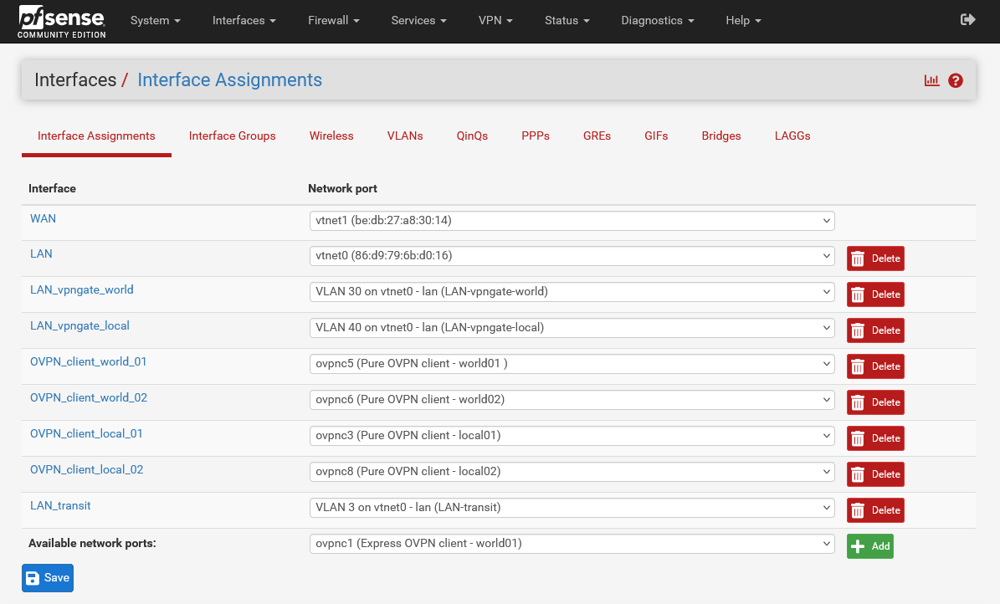
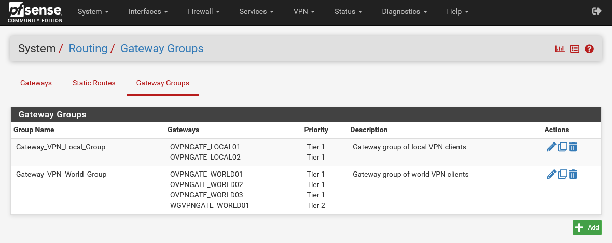
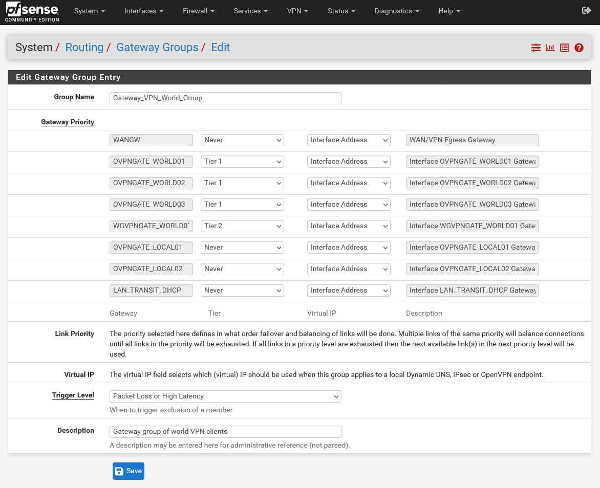
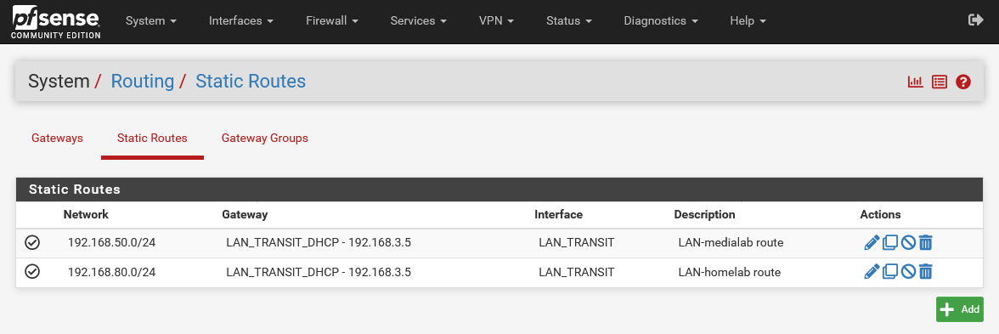

<h1>PVE pfSense VM</h1>

This guide is for installing and configuring a PVE pfSense VM with OpenVPN client gateways in an UniFi network environment.

Included are step-by-step instructions to configure your network with two OpenVPN VLAN gateway networks.

* `LAN-vpngate-world` - VLAN30 - A OpenVPN gateway pool to your chosen VPN provider exit points. The gateway can be configured with single or multiple OpenVPN tunnels for redundancy and improved data speed. All "LAN-vpngate-world" clients should be outside of your country or union - a safe zone outside of your jurisdiction.
* `LAN-vpngate-local` - VLAN40 - A OpenVPN gateway pool to your chosen VPN provider exit points. The gateway can be configured with single or multiple OpenVPN tunnels for redundancy and improved data speed. This VPN gateway connects to servers that are either local, in-country, or within your union and should provide a faster connection speed than "LAN-vpngate-world".

This installation utilizes the pfSense inbuilt `Backup & Restore` function. You simply import our pfSense configuration XML file and your pfSense device is fully configured with our default settings. But your network devices must first be configured.

<h2>Prerequisites</h2>

**Network Prerequisites**

- [x] Layer 2/3 Network Switches
- [x] Network Gateway (*recommend xxx.xxx.xxx.5*)
- [x] Network DHCP server (*recommend xxx.xxx.xxx.5*)
- [x] Network DNS server (*recommend xxx.xxx.xxx.5*)
- [x] Network Name Server
- [x] PiHole CT DNS server. Configured with Conditional Forwarding addresses:
    * Router DNS server (i.e 192.168.1.5 - UniFi DNS)
    * New LAN-vpngate-world DNS Server (i.e 192.168.30.5 - pfSense VLAN30)
    * New LAN-vpngate-local DNS Server (i.e 192.168.40.5 - pfSense VLAN40)
- [x] Local domain name is set on all network devices (*see note below*)
- [x] PVE host hostnames are suffixed with a numeric (*i.e pve-01 or pve01 or pve1*)
- [x] PVE host 2x physical LAN Nics available (LAN & WAN)
- [x] PVE host has internet access

**Must Read - Local DNS Records*
You must read about network DNS and why PiHole is required.
* Click <a href="https://github.com/ahuacate/common/tree/master/pve/src/local_dns_records.md" target="_blank">HERE</a> before proceeding any further.

> Note: The network Local Domain or Search domain must be set. We recommend only top-level domain (spTLD) names for residential and small networks names because they cannot be resolved across the internet. Routers and DNS servers know, in theory, not to forward ARPA requests they do not understand onto the public internet. It is best to choose one of our listed names: local, home.arpa, localdomain or lan only. Do NOT use made-up names.

**Required Prerequisites**

- [x] Proxmox node (PVE-01) is configured as per [PVE-HOST-SETUP](https://github.com/ahuacate/pve-host-setup) with 2 or more LAN NICs.
- [x] PVE PiHole CT configured with conditional forwarding for all "LAN-vpngate" networks (i.e DNS/DHCP servers 192.168.30.5 and 192.168.40.5) and your local DNS server (i.e UniFi DNS/DHCP server 192.168.1.5)
- [x] pfSense ISO Version 2.6 or later. Available [here](https://www.pfsense.org/download/)

<h4>Table of Contents</h4>

<!-- TOC -->

- [1. Prepare your UniFi network](#1-prepare-your-unifi-network)
    - [1.1. Configure UniFi Default WAN](#11-configure-unifi-default-wan)
    - [1.2. Configure UniFi LAN networks](#12-configure-unifi-lan-networks)
        - [1.2.1. Configure UniFi default network](#121-configure-unifi-default-network)
        - [1.2.2. Configure UniFi WAN network (VLAN2)](#122-configure-unifi-wan-network-vlan2)
        - [1.2.3. Configure UniFi LAN-transit-pfsense network (VLAN3)](#123-configure-unifi-lan-transit-pfsense-network-vlan3)
        - [1.2.4. Configure UniFi LAN-medialab network (VLAN50)](#124-configure-unifi-lan-medialab-network-vlan50)
        - [1.2.5. Configure UniFi LAN-smart network (VLAN20)](#125-configure-unifi-lan-smart-network-vlan20)
        - [1.2.6. Configure UniFi LAN-vpngate VLAN-only networks (VLAN30 & VLAN40 - pfSense hosted DHCP & DNS)](#126-configure-unifi-lan-vpngate-vlan-only-networks-vlan30--vlan40---pfsense-hosted-dhcp--dns)
    - [1.3. Assign UniFi switch ports](#13-assign-unifi-switch-ports)
        - [1.3.1. Assign switch port to PVE-LAN](#131-assign-switch-port-to-pve-lan)
        - [1.3.2. Assign switch port to WAN VLAN2](#132-assign-switch-port-to-wan-vlan2)
    - [1.4. Configure UniFi Static Routes](#14-configure-unifi-static-routes)
    - [1.5. Create UniFi Profiles](#15-create-unifi-profiles)
        - [1.5.1. All Chromecast broadcast IP addresses](#151-all-chromecast-broadcast-ip-addresses)
        - [1.5.2. All Chromecast host IP addresses](#152-all-chromecast-host-ip-addresses)
        - [1.5.3. All Chromecast ports](#153-all-chromecast-ports)
        - [1.5.4. All DNS ports](#154-all-dns-ports)
        - [1.5.5. All IP addresses](#155-all-ip-addresses)
        - [1.5.6. All local addresses](#156-all-local-addresses)
        - [1.5.7. All local user addresses](#157-all-local-user-addresses)
        - [1.5.8. All not LAN-smart local addresses](#158-all-not-lan-smart-local-addresses)
        - [1.5.9. All PiHole IP addresses](#159-all-pihole-ip-addresses)
        - [1.5.10. All printer host IP addresses](#1510-all-printer-host-ip-addresses)
        - [1.5.11. All printer ports](#1511-all-printer-ports)
        - [1.5.12. Block DNS IP addresses](#1512-block-dns-ip-addresses)
        - [1.5.13. CCTV host IP addresses](#1513-cctv-host-ip-addresses)
        - [1.5.14. CCTV ports](#1514-cctv-ports)
        - [1.5.15. Google DNS IP addresses](#1515-google-dns-ip-addresses)
        - [1.5.16. Home Assistant host IP addresses](#1516-home-assistant-host-ip-addresses)
        - [1.5.17. Jellyfin host IP addresses](#1517-jellyfin-host-ip-addresses)
        - [1.5.18. Jellyfin ports](#1518-jellyfin-ports)
        - [1.5.19. LAN-vpngate-world addresses](#1519-lan-vpngate-world-addresses)
        - [1.5.20. LAN-vpngate-local addresses](#1520-lan-vpngate-local-addresses)
        - [1.5.21. MQTT ports](#1521-mqtt-ports)
        - [1.5.22. SSDP ports](#1522-ssdp-ports)
    - [1.6. Configure UniFi Firewall Rules](#16-configure-unifi-firewall-rules)
        - [1.6.1. Block DNS list from all local LAN (excluding LAN-smart)](#161-block-dns-list-from-all-local-lan-excluding-lan-smart)
        - [1.6.2. Allow All Established And Related Sessions](#162-allow-all-established-and-related-sessions)
        - [1.6.3. Accept All NTP Requests](#163-accept-all-ntp-requests)
        - [1.6.4. Allow LAN-smart to Jellyfin Server](#164-allow-lan-smart-to-jellyfin-server)
        - [1.6.5. Allow PiHole DNS in](#165-allow-pihole-dns-in)
- [2. Prepare your Proxmox host](#2-prepare-your-proxmox-host)
- [3. Create a Proxmox pfSense VM](#3-create-a-proxmox-pfsense-vm)
    - [3.1. Download the latest pfSense ISO](#31-download-the-latest-pfsense-iso)
    - [3.2. Create a pfSense VM](#32-create-a-pfsense-vm)
    - [3.3. Start pfSense installer on the new VM](#33-start-pfsense-installer-on-the-new-vm)
- [4. Configure pfSense using our restore file](#4-configure-pfsense-using-our-restore-file)
- [5. Configure pfSense to your network requirements](#5-configure-pfsense-to-your-network-requirements)
    - [5.1. Run pfSense Setup Wizard](#51-run-pfsense-setup-wizard)
- [6. Configure pfSense AES-NI or BSD-Crypto](#6-configure-pfsense-aes-ni-or-bsd-crypto)
- [7. Configure pfSense OpenVPN client servers](#7-configure-pfsense-openvpn-client-servers)
    - [7.1. Add pfSense OpenVPN Client Certificate details](#71-add-pfsense-openvpn-client-certificate-details)
    - [7.2. Create pfSense OpenVPN Client Server(s)](#72-create-pfsense-openvpn-client-servers)
- [8. pfSense completion status](#8-pfsense-completion-status)
    - [8.1. LAN-vpngate-world clients](#81-lan-vpngate-world-clients)
- [9. Manual pfSense build](#9-manual-pfsense-build)
- [10. Preventing IP address leaks](#10-preventing-ip-address-leaks)
- [11. General system setup](#11-general-system-setup)
- [12. Configure pfSense interface VLANs](#12-configure-pfsense-interface-vlans)
- [13. Configure pfSense interfaces](#13-configure-pfsense-interfaces)
    - [13.1. Add or Edit interface WAN](#131-add-or-edit-interface-wan)
    - [13.2. Add or Edit interface LAN](#132-add-or-edit-interface-lan)
    - [13.3. Add or Edit interface LAN_transit](#133-add-or-edit-interface-lan_transit)
    - [13.4. Add or Edit LAN_vpngate interfaces](#134-add-or-edit-lan_vpngate-interfaces)
    - [13.5. Add or Edit OpenVPN client interface (ovpnc)](#135-add-or-edit-openvpn-client-interface-ovpnc)
    - [13.6. Configure pfSense Interface Groups](#136-configure-pfsense-interface-groups)
        - [13.6.1. Create Interface Groups for "vpngate-world" & "vpngate-local"](#1361-create-interface-groups-for-vpngate-world--vpngate-local)
- [14. Configure pfSense Gateways](#14-configure-pfsense-gateways)
    - [14.1. Edit WAN Gateway](#141-edit-wan-gateway)
    - [14.2. Create LAN_TRANSIT_DHCP Gateway](#142-create-lan_transit_dhcp-gateway)
- [15. Configure pfSense Routing Gateway Groups](#15-configure-pfsense-routing-gateway-groups)
    - [15.1. Create Gateway_VPN_World_Group](#151-create-gateway_vpn_world_group)
    - [15.2. Create Gateway_VPN_World_Local](#152-create-gateway_vpn_world_local)
- [16. Configure pfSense Static Routes](#16-configure-pfsense-static-routes)
    - [16.1. Create LAN-medialab static route](#161-create-lan-medialab-static-route)
    - [16.2. Create LAN-homelab static route (optional)](#162-create-lan-homelab-static-route-optional)
- [17. Disable Gateway monitoring](#17-disable-gateway-monitoring)
- [18. Reboot pfSense](#18-reboot-pfsense)
- [19. Configure pfSense DNS Resolver](#19-configure-pfsense-dns-resolver)
    - [19.1. Configure DNS Resolver General Settings](#191-configure-dns-resolver-general-settings)
    - [19.2. Configure DNS Resolver Advanced Settings](#192-configure-dns-resolver-advanced-settings)
    - [19.3. Configure pfSense DHCP Servers](#193-configure-pfsense-dhcp-servers)
- [20. Configure pfSense Firewall NAT rules](#20-configure-pfsense-firewall-nat-rules)
- [21. Configure pfSense Firewall Aliases](#21-configure-pfsense-firewall-aliases)
    - [21.1. Create all pfSense Aliases](#211-create-all-pfsense-aliases)
- [22. Configure pfSense Firewall Rules](#22-configure-pfsense-firewall-rules)
    - [22.1. Create all pfSense Firewall Rules](#221-create-all-pfsense-firewall-rules)
- [23. Setup NTP Service](#23-setup-ntp-service)
- [24. Install pfSense required packages](#24-install-pfsense-required-packages)
    - [24.1. Setup Avahi package](#241-setup-avahi-package)
- [25. Finish Up](#25-finish-up)
- [26. Create a pfSense Backup](#26-create-a-pfsense-backup)
- [27. Patches and Fixes](#27-patches-and-fixes)

<!-- /TOC -->

# 1. Prepare your UniFi network
Our pfSense build requires some network customization. This guide is based on UniFi switches and routers. The UniFi configurations should easily translate to other brands of network hardware.

We recommend you first read our Github UniFi build guide to fully configure your network: [UniFi Build](https://github.com/ahuacate/unifibuild). This guide shows only the minimum network configuration which is required for a pfSense installation.

## 1.1. Configure UniFi Default WAN
For those with a UniFi UGS/UDM heres my internet WAN configuration.

## 1.2. Configure UniFi LAN networks
We use VLANs to separate networks for easier management and to apply security policies.

### 1.2.1. Configure UniFi default network
The first step is to edit your default LAN network configuration.

Navigate using the UniFi controller web interface to `Settings` > `Networks` > `Create New Network` and complete as follows.

| Description | Default
| :---  | :---
| Network Name |`Default`
| GatewayIP/Subnet | `☐` Auto Scale Network
|| `192.168.1.5/24`
| **Advanced Configuration** | `manual`
| Network Type | `☑` Standard `☐` Guest
| IGMP Snooping | `☑` Enable
| Multicast DNS | `☐` Enable
| Network Group | `LAN`
| **DHCP**
| DHCP Mode | `DHCP Server`
| DHCP Range | `192.168.1.150`-`192.168.1.250`
| DHCP Service Management
| DHCP DNS Server | `☑` Enabled
|| `192.168.1.254` | PiHole IP address
| DHCP Default Gateway | `☑` Auto
| DHCP Lease Time | `86400`
| Domain Name | `local`
| **IPv6**
| IPv6 Interface Type | `☑` None `☐` Static `☐` Prefix 

### 1.2.2. Configure UniFi WAN network (VLAN2)
Create a dedicated VLAN2 network for pfSense WAN only (labeled VPN-egress). All pfSense VPN traffic will exit pfSense on WAN VLAN2. For added security, we assign VLAN2 Guest status.

Navigate using the UniFi controller web interface to `Settings` > `Networks` > `Create New Network` and complete as follows.

| Description | LAN-egress
| :---  | :---
| Network Name |`LAN-egress`
| GatewayIP/Subnet | `☐` Auto Scale Network
|| `192.168.2.5/28`
| **Advanced Configuration** | `manual`
| VLAN ID | `2`
| Network Type | `☐` Standard `☑` Guest
| IGMP Snooping | `☑` Enable
| Multicast DNS | `☐` Enable
| Network Group | `LAN`
| **DHCP**
| DHCP Mode | `DHCP Server`
| DHCP Range | `192.168.2.1`-`192.168.2.14`
| **IPv6**
| IPv6 Interface Type | `☑` None `☐` Static `☐` Prefix 

### 1.2.3. Configure UniFi LAN-transit-pfsense network (VLAN3)
Here we configure a uplink between the UniFi switch to the pfSense LAN interface. This can be referred to as a “Transit” network for traffic between the two devices.

Navigate using the UniFi controller web interface to `Settings` > `Networks` > `Create New Network` and complete as follows.

| Description | LAN-transit-pfsense
| :---  | :---
| Network Name |`LAN-transit-pfsense`
| GatewayIP/Subnet | `☐` Auto Scale Network
|| `192.168.3.5/28`
| **Advanced Configuration** | `manual`
| VLAN ID | `3`
| Network Type | `☑` Standard `☐` Guest
| IGMP Snooping | `☑` Enable
| Multicast DNS | `☐` Enable
| Network Group | `LAN`
| **DHCP**
| DHCP Mode | `DHCP Server`
| DHCP Range | `192.168.3.1`-`192.168.3.14`
| **IPv6**
| IPv6 Interface Type | `☑` None `☐` Static `☐` Prefix 

### 1.2.4. Configure UniFi LAN-medialab network (VLAN50)
LAN-medialab is vlan50 which is the network for all media-related clients and servers.

Navigate using the UniFi controller web interface to `Settings` > `Networks` > `Create New Network` and complete as follows.

| Description | LAN-medialab
| :---  | :---
| Network Name |`LAN-medialab`
| GatewayIP/Subnet | `☐` Auto Scale Network
|| `192.168.50.5/24`
| **Advanced Configuration** | `manual`
| VLAN ID | `50`
| Network Type | `☑` Standard `☐` Guest
| IGMP Snooping | `☑` Enable
| Multicast DNS | `☑` Enable
| Network Group | `LAN`
| **DHCP**
| DHCP Mode | `DHCP Server`
| DHCP Range | `192.168.50.150`-`192.168.50.254`
| DHCP DNS Server | `☑` Enable
|| `192.168.1.254` (PiHole IPv4 address)
| **IPv6**
| IPv6 Interface Type | `☑` None `☐` Static `☐` Prefix 

### 1.2.5. Configure UniFi LAN-smart network (VLAN20)
LAN-smart is VLAN20 which is the network for all media player clients such TVs and media players. We separate these devices in order to use smart DNS services to bypass geo-restrictions or even allow Google DNS.

All other networks use PiHole.

Navigate using the UniFi controller web interface to `Settings` > `Networks` > `Create New Network` and complete as follows.

| Description | LAN-medialab
| :---  | :---
| Network Name |`LAN-smart`
| GatewayIP/Subnet | `☐` Auto Scale Network
|| `192.168.20.5/24`
| **Advanced Configuration** | `manual`
| VLAN ID | `20`
| Network Type | `☑` Standard `☐` Guest
| IGMP Snooping | `☑` Enable
| Multicast DNS | `☑` Enable
| Network Group | `LAN`
| **DHCP**
| DHCP Mode | `DHCP Server`
| DHCP Range | `192.168.20.150`-`192.168.20.254`
| DHCP DNS Server | `☑` Enable
|| `8.8.8.8` (SmartDNS proxy or Google)
|| `8.8.4.4` (SmartDNS proxy or Google)
| **IPv6**
| IPv6 Interface Type | `☑` None `☐` Static `☐` Prefix 

### 1.2.6. Configure UniFi LAN-vpngate VLAN-only networks (VLAN30 & VLAN40 - pfSense hosted DHCP & DNS)
Both new "LAN-vpngate-world" and "LAN-vpngate-local" networks are hosted on pfSense including DHCP and DNS. On UniFi you only need to create two matching VLAN-only networks.

Navigate using the UniFi controller web interface to `Settings` > `Networks` > `Create New Network` and complete as follows.

| Description | vpngate-world | vpngate-local
| :---  | :--- | :---
| Network Name |`LAN-vpngate-world`| `LAN-vpngate-local`
| Router | `☑` VLAN-only Network | `☑` VLAN-only Network
| VLAN ID | `30` | `40`
| IGMP Snooping | `☐` Enable | `☐` Enable
| DHCP Guarding | `☑` Enable | `☑` Enable
| DHCP Server IP | `192.168.30.5` | `192.168.40.5`

## 1.3. Assign UniFi switch ports
In UniFi you must assign the 2x physical LAN cables connecting your UniFi switch to your Proxmox host or pfSense device with a UniFi Port Profile. Both LAN and WAN connections must be identified. For cable management I dedicate switch ports 1-6 to my Proxmox cluster.

### 1.3.1. Assign switch port to PVE-LAN
Navigate using the UniFi controller web interface to `Devices` > `Select switch device` > `Port Management` and then select the switch port which is physically connected and assigned to Proxmox host or pfSense as LAN.

My Proxmox and pfSense "LAN" is a port aggregate of UniFi NIC ports 1 & 2 which is not a requirement.

What important is the UniFi `Port Profile` of your selected NIC port must be assigned as `All`.

### 1.3.2. Assign switch port to WAN VLAN2
Navigate using the UniFi controller web interface to `Devices` > `Select switch device` > `Port Management` and then select the switch port which is physically connected and assigned to pfSense as WAN (vpn-egress).

My pfSense "WAN" is a port aggregate of UniFi NIC ports 3 & 4 which is not a requirement.

What important is the UniFi `Port Profile` of your selected NIC port must be assigned as `VPN-egress`.

## 1.4. Configure UniFi Static Routes
Create the following static routes for your two "vpngate" networks.

Navigate using the UniFi controller web interface to `Settings` > `Traffic Management` > `Static Routes` > `Create New Static Route` and create two entries as follows.

| Description | vpngate-world | vpngate-local
| :---  | :--- | :---
| Name | `Route access to VLAN30` | `Route access to VLAN40`
| Distance| `1` | `1`
| Destination Network | `192.168.30.0/24` | `192.168.40.0/24`
| Type | `☑` Next Hop | `☑` Next Hop
| Next Hop | `192.168.3.1` | `192.168.3.1`

## 1.5. Create UniFi Profiles
UniFi allows for the configuration of Profiles for ports and IP groups. Profiles are used to make parameter sets for quick building of Firewall Rules.

Navigate using the UniFi controller web interface to `Settings` > `Profiles` > `Ports and IP Groups` > `Create New Group` and complete as follows. Remember to click `Apply Changes` at each step.

### 1.5.1. All Chromecast broadcast IP addresses
Here we allow Chromecast to pass traffic in on 2 networks:
*  LAN-smart (vlan20)
*  LAN-medialab (vlan50)

| Ports and IP Groups | Value | Notes
| :---  | :--- | :---
| Profile Name | `All Chromecast broadcast IP addresses` |
| Type | `☑` IPv4 Addresses/subnet |
| Address ||
|| `192.168.20.0/24` | LAN-smart
|| `192.168.50.0/24` | LAN-medialab

### 1.5.2. All Chromecast host IP addresses
| Ports and IP Groups | Value | Notes
| :---  | :--- | :---
| Profile Name | `All Chromecast host IP addresses` |
| Type | `☑` IPv4 Addresses/subnet |
| Address ||
|| `192.168.20.151` | i.e LG OLED TV

### 1.5.3. All Chromecast ports
| Ports and IP Groups | Value | Notes
| :---  | :--- | :---
| Profile Name | `All Chromecast ports` |
| Type | `☑` Port Group |
| Port ||
|| `8008` | Chromecast port range
|| `8009` | Chromecast port range
|| `5353` | Multicast mDNS port
|| `1900` | SSDP port
|| `8443` | Chromecast port (across vlans)

### 1.5.4. All DNS ports
| Ports and IP Groups | Value | Notes
| :---  | :--- | :---
| Profile Name | `All DNS ports` |
| Type | `☑` Port Group |
| Port ||
|| `53`
|| `853`

### 1.5.5. All IP addresses
Amend to your subnet.
| Ports and IP Groups | Value | Notes
| :---  | :--- | :---
| Profile Name | `All IP addresses` |
| Type | `☑` IPv4 Addresses/subnet |
| Address ||
|| `0.0.0.0/1`
|| `128.0.0.0/2`
|| `192.0.0.0/3`
|| `224.0.0.0/4`

### 1.5.6. All local addresses
Amend to your subnet.
| Ports and IP Groups | Value | Notes
| :---  | :--- | :---
| Profile Name | `All IP addresses` |
| Type | `☑` IPv4 Addresses/subnet |
| Address ||
|| `192.168.1.0/24` | Default
|| `192.168.3.0/24` | LAN-transit-pfsense
|| `192.168.10.0/24` | LAN-open
|| `192.168.20.0/24` | LAN-smart
|| `192.168.30.0/24` | LAN-vpngate-world (VLAN-only)
|| `192.168.40.0/24` | LAN-vpngate-local (VLAN-only)
|| `192.168.50.0/24` | LAN-medialab
|| `192.168.60.0/24` | LAN-vpnserver
|| `192.168.70.0/24` | LAN-guest
|| `192.168.80.0/24` | LAN-homelab
|| `192.168.110.0/24` | LAN-IoT
|| `192.168.120.0/24` | LAN-NoT

### 1.5.7. All local user addresses
Amend to your subnet.
| Ports and IP Groups | Value | Notes
| :---  | :--- | :---
| Profile Name | `All local user addresses` |
| Type | `☑` IPv4 Addresses/subnet |
| Address ||
|| `192.168.1.0/24` | Default
|| `192.168.10.0/24` | LAN-open
|| `192.168.40.0/24` | LAN-vpngate-local (VLAN-only)

### 1.5.8. All not LAN-smart local addresses
This profile of all non LAN-smart networks. Mostly used in DNS block rule. Amend to your subnet.
| Ports and IP Groups | Value | Notes
| :---  | :--- | :---
| Profile Name | `All not LAN-smart local addresses` |
| Type | `☑` IPv4 Addresses/subnet |
| Address ||
|| `192.168.1.0/24` | Default
|| `192.168.3.0/24` | LAN-transit-pfsense
|| `192.168.10.0/24` | LAN-open
|| `192.168.30.0/24` | LAN-vpngate-world (VLAN-only)
|| `192.168.40.0/24` | LAN-vpngate-local (VLAN-only)
|| `192.168.50.0/24` | LAN-medialab
|| `192.168.60.0/24` | LAN-vpnserver
|| `192.168.70.0/24` | LAN-guest
|| `192.168.80.0/24` | LAN-homelab
|| `192.168.110.0/24` | LAN-IoT
|| `192.168.120.0/24` | LAN-NoT

### 1.5.9. All PiHole IP addresses
Amend to your subnet.
| Ports and IP Groups | Value | Notes
| :---  | :--- | :---
| Profile Name | `All PiHole IP addresses` |
| Type | `☑` IPv4 Addresses/subnet |
| Address ||
|| `192.168.1.254` | PiHole IP address

### 1.5.10. All printer host IP addresses
Assign a dhcp static IP map to all printers. Add the IP address of all network printers. Amend to your subnet.

| Ports and IP Groups | Value | Notes
| :---  | :--- | :---
| Profile Name | `All printer host IP addresses` |
| Type | `IPv4 Addresses/subnet` |
| Address ||
|| `i.e 192.168.1.91` | i.e Brother laser printer

### 1.5.11. All printer ports
Add the required printer tcp/udp ports. Add accordingly.

| Ports and IP Groups | Value | Notes
| :---  | :--- | :---
| Profile Name | `All printer ports` |
| Type | `Port Group` |
| Port ||
|| `137` | Default generic SMB (works with Brother laser)
|| `138` | Default generic SMB
|| `139` | Default generic SMB
|| `631` | ASCII laser printer (works with Brother laser)
|| `6310` | ASCII laser printer
|| `9100` | ASCII laser printer - IBM, Ricoh, HP, Lexmark
|| `9101` | ASCII laser printer - Jetdirect, Marknet server

### 1.5.12. Block DNS IP addresses
Add any DNS service provider IP address you want block. We include hardcoded Google DNS in the list to stop circumvention of your UniFi or PiHole DNS settings.

| Ports and IP Groups | Value | Notes
| :---  | :--- | :---
| Profile Name | `Block DNS IP addresses` |
| Type | `IPv4 Addresses/subnet` |
| Address ||
|| `8.8.8.8` | Google DNS
|| `8.8.4.4` | Google DNS

### 1.5.13. CCTV host IP addresses
Amend to your subnet.

| Ports and IP Groups | Value | Notes
| :---  | :--- | :---
| Profile Name | `CCTV host IP addresses` |
| Type | `IPv4 Addresses/subnet` |
| Address ||
|| Add as required |

### 1.5.14. CCTV ports
| Ports and IP Groups | Value | Notes
| :---  | :--- | :---
| Profile Name | `CCTV ports` |
| Type | `Port Group` |
| Port ||
|| Add as required |

### 1.5.15. Google DNS IP addresses
| Ports and IP Groups | Value | Notes
| :---  | :--- | :---
| Profile Name | `Google DNS IP addresses` |
| Type | `IPv4 Addresses/subnet` |
| Address ||
|| `8.8.8.8` |
|| `8.8.4.4` |

### 1.5.16. Home Assistant host IP addresses
| Ports and IP Groups | Value | Notes
| :---  | :--- | :---
| Profile Name | `Home Assistant host IP addresses` |
| Type | `IPv4 Addresses/subnet` |
| Address ||
|| `192.168.110.131` |

### 1.5.17. Jellyfin host IP addresses
| Ports and IP Groups | Value | Notes
| :---  | :--- | :---
| Profile Name | `Jellyfin host IP addresses` |
| Type | `IPv4 Addresses/subnet` |
| Address ||
|| `192.168.50.150` |

### 1.5.18. Jellyfin ports
| Ports and IP Groups | Value | Notes
| :---  | :--- | :---
| Profile Name | `Jellyfin ports` |
| Type | `Port Group` |
| Port ||
|| `8096` | Default Jellyfin port

### 1.5.19. LAN-vpngate-world addresses
| Ports and IP Groups | Value | Notes
| :---  | :--- | :---
| Profile Name | `LAN-vpngate-world addresses` |
| Type | `IPv4 Addresses/subnet` |
| Address ||
|| `192.168.30.0/24` |

### 1.5.20. LAN-vpngate-local addresses
| Ports and IP Groups | Value | Notes
| :---  | :--- | :---
| Profile Name | `LAN-vpngate-local addresses` |
| Type | `IPv4 Addresses/subnet` |
| Address ||
|| `192.168.40.0/24` |

### 1.5.21. MQTT ports
| Ports and IP Groups | Value | Notes
| :---  | :--- | :---
| Profile Name | `MQTT ports` |
| Type | `Port Group` |
| Port ||
|| `1883` |
|| `8883` |

### 1.5.22. SSDP ports
| Ports and IP Groups | Value | Notes
| :---  | :--- | :---
| Profile Name | `SSDP ports` |
| Type | `Port Group` |
| Port ||
|| `1900` |

## 1.6. Configure UniFi Firewall Rules
Navigate using the UniFi controller web interface to `Settings` > `Firewall & Security` > `Firewall Rules` > `Create New Rule` and complete as follows. Remember to click `Apply Changes`.

### 1.6.1. Block DNS list from all local LAN (excluding LAN-smart)
| Item | Value | Notes
| :---  | :--- | :---
| Type | `Internet Out` |
| Description | `Block DNS list from all local LAN (excluding LAN-smart)`
| Rule Applied | `Before Predefined Rules` |
| Action | `☐` Accept `☐` Reject `☑` Drop
| Ipv4 Protocol | `All`
| **Source**
| Source Type | `Port/IP Group`
| IPv4 Address Group | `All not LAN-smart local addresses`
| Port Group | `Any`
| MAC Address | Leave blank
| **Destination**
| Destination Type | `Port/IP Group`
| IPv4 Address Group | `Block DNS IP addresses`
| Port Group | `Any`
| **Advanced** | `Auto`

### 1.6.2. Allow All Established And Related Sessions
| Item | Value | Notes
| :---  | :--- | :---
| Type | `LAN In` |
| Description | `Block DNS list from all local LAN (excluding LAN-smart)`
| Rule Applied | `Before Predefined Rules` |
| Action | `☑` Accept `☐` Reject `☐` Drop
| Ipv4 Protocol | `All`
| **Source**
| Source Type | `Port/IP Group`
| IPv4 Address Group | `All local addresses`
| Port Group | `Any`
| MAC Address | Leave blank
| **Destination**
| Destination Type | `Port/IP Group`
| IPv4 Address Group | `All local addresses`
| Port Group | `Any`
| **Advanced** | `Manual`
| States | `☐` Match State New
|| `☑` Match State Established
|| `☐` Match State Invalid
|| `☑` Match State Related
| IPsec | `Don't match on IPsec packets`
| Logging | `☐` Enable

### 1.6.3. Accept All NTP Requests
| Item | Value | Notes
| :---  | :--- | :---
| Type | `LAN In` |
| Description | `Accept All NTP Requests`
| Rule Applied | `Before Predefined Rules` |
| Action | `☑` Accept `☐` Reject `☐` Drop
| Ipv4 Protocol | `All`
| **Source**
| Source Type | `Port/IP Group`
| IPv4 Address Group | `All local addresses`
| Port Group | `Any`
| MAC Address | Leave blank
| **Destination**
| Destination Type | `Port/IP Group`
| IPv4 Address Group | `Any`
| Port Group | `NTP ports`
| **Advanced** | `Auto`

### 1.6.4. Allow LAN-smart to Jellyfin Server
| Item | Value | Notes
| :---  | :--- | :---
| Type | `LAN In` |
| Description | `Allow LAN-smart to Jellyfin Server`
| Rule Applied | `Before Predefined Rules` |
| Action | `☑` Accept `☐` Reject `☐` Drop
| Ipv4 Protocol | `All`
| **Source**
| Source Type | `Network`
| Network | `LAN-smart`
| Network Type | `IPv4 subset`
| MAC Address | Leave blank
| **Destination**
| Destination Type | `Port/IP Group`
| IPv4 Address Group | `Jellyfin host IP addresses`
| Port Group | `Jellyfin ports`
| **Advanced** | `Auto`

### 1.6.5. Allow PiHole DNS in
| Item | Value | Notes
| :---  | :--- | :---
| Type | `Guest In` |
| Description | `Allow PiHole DNS in`
| Rule Applied | `Before Predefined Rules` |
| Action | `☑` Accept `☐` Reject `☐` Drop
| Ipv4 Protocol | `UDP`
| **Source**
| Source Type | `Port/IP Group`
| IPv4 Address Group | `Any`
| Port Group | `Any`
| MAC Address | Leave blank
| **Destination**
| Destination Type | `Port/IP Group`
| IPv4 Address Group | `All PiHole addresses`
| Port Group | `Any`
| **Advanced** | `Auto`

# 2. Prepare your Proxmox host
Your Proxmox hosts must have 2x configured Network Linux Bridges for pfSense to work. Amend the IP addresses to suit your network subnets.

| Name | IPv4/CIDR | Gateway | VLAN aware
| :---  | :--- | :--- | :---
| vmbr0 | 192.168.1.101/24 | 192.168.1.5 | :white_check_mark:
| vmbr2 |||:white_check_mark:

# 3. Create a Proxmox pfSense VM
Our pfSense machine is hosted on Proxmox. You could also install pfSense on any x86 hard metal machine with 2x LAN NICS.

## 3.1. Download the latest pfSense ISO
Use the Proxmox WebGUI to add the latest pfSense installation ISO which is available from [HERE](https://www.pfsense.org/download/). Upload the latest pfSense ISO file to Proxmox.

## 3.2. Create a pfSense VM
Navigate using the Proxmox PVE-01 web interface to  (should be https://192.168.1.101:8006/ ) `pve-01` > `Create VM` and fill out the details as shown below (whats not shown below leave as default)

| General | Value 
| :---  | :--- |
| Node |`pve-01`
| VM ID | `253`
| Name | `pfsense` |
| Start at Boot | `☑` Enabled
| Start/Shutdown order | `1`
| Resource Pool | Leave blank
| **OS**
| Use CD/DVD disc image file (ISO) | `pfSense-CE-2.x.x-RELEASE-amd64.iso`
| Guest OS 
| Type | `Other`
| **System**
| Graphic card | `Default`
| Machine | `Default (i440fx)` Qemu Agent `☐` 
| BIOS | `Default (SeaBIOS)` Add TPM `☐`
| SCSI Controller | `VirtIO SCSI`
| **Disks**
| Bus/Device | `IDE 0`
| Storage | `local-lvm` or `local-zfs`
| Disk size (GiB) | `32`
| Cache | `Default (No Cache)`
| Discard | `☐`
| SSD emulation | `☐`
| Async IO | `Default (io_uring)`
| **CPU**
| Sockets | `1`
| Cores | `1`
| Type | `host`
| CPU units | `1024`
| Enable NUMA | `☐`
| **Memory**
| Memory (MiB) | `4096`
| Minimum Memory (MiB) | `4096`
| Ballooning Device | `☑` Enabled
| **Network**
| Bridge | `vmbr0`
| VLAN Tag | `no VLAN`
| Model | `VirtIO (paravirtualized)`
| MAC Address | `auto`
| **Confirm**
| Start after created | `☐` Disabled

Navigate using the Proxmox web interface to `pve-01` > `253 (pfsense)` > `Hardware` > `Add` > `Network Device` create the following additional network bridges as shown below:

| Description | Value |
| :---  | :---: |
| Bridge | **`vmbr2`** (WAN) |
| VLAN Tag | `no VLAN` |
| Model | `VirtIO (paravirtualized)` |

Your PVE `pfSense` > `hardware` network setup should be exactly as shown below. Make sure the "Network Devices" are correctly assigned assigned to the matching WAN and LAN Nic ports. This is VERY IMPORTANT.

## 3.3. Start pfSense installer on the new VM
Navigate using the Proxmox PVE-01 web interface to (should be https://192.168.1.101:8006/ ) `pve-01` > `253 (pfsense)` > `Start`. When running click on the VM `>_Console` tab and you should see the installation script running. Follow the prompts and fill out the details as shown below.

| pfSense Installation Step | Value | Notes
| :--- | :--- | :---
| Copyright and distribution notice | `Accept` 	
| Welcome to pfSense / Install pfSense | `<OK>` 	
| Keymap Selection / >>> Continue with default keymap | `<Select>` 	
| Partitioning / Auto (UFS) BIOS - Guided Disk Setup | `<OK>`	
| Manual Configuration | `<No>` 	
| Complete | `<Reboot>` 	
| **The reboot phase**		
| Should VLANs be setup now? | `n` 	
| Enter the WAN interface name or 'a' for auto-detection | `vtnet1` | Double check here. Make sure you select the WAN interface.
| Enter the LAN interface name or 'a' for auto-detection | `vtnet0`	
| Do you want to proceed [y:n] |`y`	

At this stage use the pfSense web interface to complete the installation. Navigate using your web browser to the pfSense LAN interface IPv4 address shown on the terminal screen. In my case the URL was `192.168.1.1`.

Ignore all the web browser security warnings. Click `Accept the Risk and Continue`. Your user credentials are:
* Username - admin  
* Password - pfsense

Do NOT complete the pfSense wizard!

# 4. Configure pfSense using our restore file
pfSense has a inbuilt `Backup & Restore` function. To configure your pfSense we import our pfSense configuration XML file. This file will configure all of the following:
* System Interfaces
* System VLANs
* System Routing
* Static Routes
* Firewall Aliases
* Firewall NAT
* Firewall Rules
* Avahi
* DHCP Servers
* DNS Resolver
* Pre-install ExpressVPN Certs
* OpenVPN ExpressVPN clients (LAN-vpngate-world and LAN-vpngate-local)
* and more.

Download our "all" configuration file from Github and save to your local computer.
* https://github.com/ahuacate/pfsense-setup/blob/master/restore/pfsense.all.xml

Experienced users can make edits directly in the `pfsense.all.xml` file to customize your values before importing into pfSense.

Navigate using the pfSense web interface to `Diagnostics` > `Backup & Restore` and at the `Restore Backup` section input the following.

| Restore Backup | Value
| :---  | :---
| Restore area | All
| Configuration file | `Browse` 
||Select filename: `pfsense.all.xml`
| Encryption | `☐` Configuration file is encrypted.
|| **Restore Configuration**

Your pfSense machine will reboot with Ahuacate configuration presets.

# 5. Configure pfSense to your network requirements
The downside is your pfSense uses our default network IP addresses. If you use the 192.168.1.0/24 subnet range and your network router gateway is 192.168.1.5 you have little to edit or change.

You can now access the pfSense webConfigurator by opening the following URL in your web browser: http://192.168.1.253/

Your user credentials are:
* Username - admin  
* Password - pfsense

## 5.1. Run pfSense Setup Wizard
Navigate using the pfSense web interface to `System` > `Setup Wizard` and configure your pfSense device. Only configure whats shown below.

| pfSense Setup wizard | Value | Notes
| :--- | :--- | :---
| **Step 1 - Welcome**	
| Netgate® Global Support is available 24/7 | `>>Next`
| **Step 2 - General information**
| Hostname | `pfSense`
| Domain | `local` | "local" is our default for our network. This domain must match all other network devices.
| Primary DNS Server | `192.168.1.5` | UniFi UGS/UDM/router IP address.
| Secondary DNS Server | `192.168.1.254` | PiHole IP address. Using PiHole alleviates so many headaches.
| Override DNS | `☐` Disabled
| **Step 3 - Time Server Information**
| Time server hostname | `2.pfsense.pool.ntp.org`
| Timezone | Select your timezone
| **Step 4 - Configure WAN Interface**
| Select Type | `Static`
| MAC Address | Leave blank
| MTU | Leave blank
| MSS | Leave blank
| IP Address | 192.168.2.1 | This must be VLAN2. Amend to your network subnet (i.e 10.0.2.1). This is the guest network you configured on your UniFi UGS/UDM/router.
| Subnet Mask | `28`
| Upstream Gateway  | `192.168.2.5` | This must be VLAN2. Amend to your network subnet (i.e 10.0.2.5). This is the guest VPN-egress network you configured on your UniFi UGS/UDM/router.
| **Step 5 - Configure LAN Interface**
| LAN IP Address | `192.168.1.253` | This is our recommended default IP only.
| Subnet Mask | `24`
| **Step 6 - Set Admin WebGUI Password**
| Admin Password | Enter your password
| Admin Password AGAIN | Enter your password
| **Step 7 - Reload configuration**
| Reload configuration| `>>Reload`
| **Step 8 - Wizard completed**
| Wizard completed | `Finish`

`Accept` the pfSense terms and you have completed this task.

You can now access the pfSense webConfigurator by opening the following URL in your web browser: http://192.168.1.253/ or whatever IP you just set.

# 6. Configure pfSense AES-NI or BSD-Crypto
If your CPU supports AES-NI or AES-NI/BSD-Crypto CPU Crypto enable it. Without crypto acceleration enabled your OpenVPN connections will be slow.

Navigate using the pfSense web interface to `System` > `Advanced` > `Miscellaneous Tab` scroll down to the section `Cryptographic & Thermal Hardware` and change the details as shown below:

| Cryptographic & Thermal Hardware | Value | Notes
| :---  | :---: | :--- |
| Cryptographic Hardware | `AES-NI CPU-based Acceleration` | Select whats appropriate for your CPU hardware. For any reasonable OpenVPN throughput speed your CPU should be at least AES-NI ready.
| Thermal Sensors | None/ACPI | Will not work when pfSense is virtualized. Proxmox virtualization host will NOT forward CPU temperature data to it's pfSense guest.

Remember to hit the `Save` button at the bottom of the page.

# 7. Configure pfSense OpenVPN client servers
pfSense is configured to use ExpressVPN. All you must do is enter your ExpressVPN username and password credentials into each OpenVPN client and it should work out of the box. Navigate using the pfSense web interface to `VPN` > `OenVPN` > `Clients` and edit the existing ExpressVPN clients inputting your username credentials.

If you use another VPN service provider then you must read-on.

For this stage you need a VPN service provider. This guide uses ExpressVPN where a standard subscription includes 5x user accounts. We use 4x OpenVPN clients: 2x vpngate-world-0(x) and 2x vpngate-local-0(x). If you need a VPN provider buy me a beer and use my referral: [Click here for a ExpressVPN account](https://www.expressrefer.com/refer-a-friend/30-days-free?referrer_id=13665833&utm_campaign=referrals&utm_medium=copy_link&utm_source=referral_dashboard).

Much of the information required is particular to your VPN provider. We recommend you complete the configuration of one OpenVPN client, duplicate it and edit the particulars.

It is important also that you give each OpenVPN Client you setup a descriptive name. My naming convention for 4 OpenVPN clients are:

| VPN Client Description Name | Notes
| :---  | :---
| **vpngate-world** | For clients like NZBGet, Deluge where the vpn servers randomly connect in chosen nations.
| VPN client-world01
| VPN client-world02
| **vpngate-local** | Main household VPN where the vpn servers connect in the region.
| VPN client-local01
| VPN client-local02

Later you have the choice to enabling load balancing or redundancy on 'vpngate-world' and 'vpngate-local' VPN clients. You can configure only one OpenVPN client or more, it’s completely your choice.

You will need your VPN account server username and password details and have your VPN server provider OVPN configuration file open in a text editor so you can copy various certificate and key details (cut & paste). Note the values for this form will vary between different VPN providers but there should be a tutorial showing your providers pfSense configuration settings on the internet somewhere. 

## 7.1. Add pfSense OpenVPN Client Certificate details
Navigate using the pfSense web interface to `System` > `Cert. Manager` > `CAs` > `Add` to open a configuration form, then fill up the necessary fields as follows.

| Create/Edit CA | Value | Notes
| :---  | :---: | :--- |
| Descriptive name | `ExpressVPN` | Or whatever your providers name is, ExpressVPN, PIA etc
| Method | `Import an existing Certificate Authority`
| **Existing Certificate Authority**
| Certificate data | `Insert your key data` | Open the OpenVPN configuration file that you downloaded and open it with your favorite text editor. Look for the text that is wrapped within the <ca> portion of the file. Copying the entire string from —–BEGIN CERTIFICATE—– to —–END CERTIFICATE—– |
| Certificate Private Key (optional) | Leave this blank
| Serial for next certificate | Leave this blank

Click `Save`. Stay on this page and click `Certificates` at the top. Click `Add`enter the following:

| Add/Sign a New Certificate | Value | Notes
| :---  | :---: | :--- |
| Descriptive name | `ExpressVPN Cert` | *Or whatever your providers name is, PIA Cert etc*
| **Import Certificate**
| Certificate data | `Insert your key data` | Open the OpenVPN configuration file that you downloaded and open it with your favorite text editor. Look for the text that is wrapped within the <cert> portion of the file. Copy the entire string from —–BEGIN CERTIFICATE—– to —–END CERTIFICATE—–
| Private key data | `Insert your key data` | With your text editor still open, look for the text that is wrapped within the <key> portion of the file. Copy the entire string from —–BEGIN RSA PRIVATE KEY—– to —-END RSA PRIVATE KEY—-

Click `Save`.

## 7.2. Create pfSense OpenVPN Client Server(s)
Navigate using the pfSense web interface to `VPN` > `OpenVPN` > `Clients Tab` > `Add` to open a configuration form, then fill up the necessary fields as follows (creating one each for `VPN client-world01`, `VPN client-world02` and `VPN client-local01`, `VPN client-local02`). Best create one and use the 'Copy icon' function to create the others:

| General Information | Value | Notes
| :---  | :---: | :--- |
| Description | `VPN client - world01` | Or 'VPN client - local01' etc
| Disabled | `☐` Disable this client
| **Mode Configuration**
| Server Mode | `Peer to Peer (SSL/TLS)`
| Device mode | `tun - Layer 3 Tunnel Mode`
| **Endpoint Configuration**
| Protocol | `UDP on IPv4 only`
| Interface | `WAN`
| Local port | Leave blank
| Server host or address : vpngate-world-01 | `netherlands-amsterdam-ca-version-2.expressnetw.com`| Open the OpenVPN configuration file that you downloaded and open it with your favorite text editor. Look for text that starts with remote, followed by a server name. Copy the server name string into this field (e.g., if you are in London maybe you want to use servers outside of your jurisdiction like netherlands-amsterdam-ca-version-2.expressnetw.com, germany-frankfurt-1-ca-version-2.expressnetw.com )
| Server host or address : vpngate-local-01 | `malaysia-ca-version-2.expressnetw.com` | Open the OpenVPN configuration file that you downloaded and open it with your favorite text editor. Look for text that starts with remote, followed by a server name. Copy the server name string into this field (e.g., if you are in Hong Kong maybe you wnat to use servers near your region like singapore-jurong-ca-version-2.expressnetw.com, malaysia-ca-version-2.expressnetw.com )
| Server port | `1195`
| Proxy host or address | Leave blank
| Proxy port | Leave blank
| Proxy authentication | `none`
| **User Authentication Settings**
| Username | `insert your account username`
| Password | `insert your account password`
| Authentication Retry | Leave disabled/default
| **Cryptographic Settings**
| TLS Configuration | `☑ Use a TLS Key`
| TLS Key | `Insert your key data` | Open the OpenVPN configuration file that you downloaded and open it with your favorite text editor. Look for text that is wrapped within the <tls-auth> portion of the file. Ignore the “2048 bit OpenVPN static key” entries and start copying from —–BEGIN OpenVPN Static key V1—– to —–END OpenVPN Static key V1—–.
| TLS Key Usage Mode | `TLS Authentication`
| TLS keydir direction | `Use default direction`
| Peer Certificate Authority | `ExpressVPN` | Select the “ExpressVPN” or named entry that you created previously in the Cert. Manager steps.
| Client Certificate | `ExpressVPN Cert` | Select the “ExpressVPN Cert” entry that you created previously in the Cert. Manager steps.
| Data Encryption Negotiation | `☐` Enable Data Encryption Negotiation
| Encryption Algorithm | `AES-256-CBC` | Open the OpenVPN configuration file that you downloaded and open it with your favorite text editor. Look for the text cipher. In this example, the OpenVPN configuration is listed as “cipher AES-256-CBC,” so we will select “AES-256-CBC (256-bit key, 128-bit block) from the drop-down.
| Fallback Data Encryption Algorithm | `AES-256-CBC (256 bit key, 128 bit block)` | Should correspond with your chosen "Data Encryption Algorithms".
| Auth digest algorithm | `SHA512 (512-bit)`| Open the OpenVPN configuration file that you downloaded and open it with your favorite text editor. Look for the text auth followed by the algorithm after. In this example, we saw “auth SHA512,” so we will select “SHA512 (512-bit)” from the dropdown.
| Hardware Crypto | `Intel RDRAND engine - RAND` | Check if your hosts CPU is AES-NI ready and select accordingly.
| Server Certificate Key Usage Validation | `☐` Enforce key usage
| **Tunnel Settings**
| IPv4 Tunnel Network | Leave blank
| IPv6 Tunnel Network | Leave blank
| IPv4 Remote network(s) | Leave blank
| IPv6 Remote network(s) | Leave blank
| Limit outgoing bandwidth | Leave blank
| Allow Compression | `Decompress incoming, do not compress outgoing (Asymmetric)`
| Compression | `Adaptive LZO Compression`
| Topology | `Subnet — One IP address per client in a common subnet` |
| Type-of-Service | `☐` Set the TOS... | Check with VPN provider.
| Don't pull routes | `☑ ` Bars the server... | Check with VPN provider.
| Don't add/remove routes | `☐` Don't add or remove... | Check with VPN provider.
| Pull DNS | `☐` Add server provided DNS | Check with VPN provider.
| **Ping Settings**
| Inactive | `0`
| Ping method | `keep alive`
| Interval | `10`
| Timeout | `60`
| **Advanced Configuration**
| Custom options | fast-io;persist-key;persist-tun;remote-random;pull;comp-lzo;tls-client;verify-x509-name Server name-prefix;remote-cert-tls server;key-direction 1;route-method exe;route-delay 2;tun-mtu 1500;fragment 1300;mssfix 1450;verb 3;sndbuf 524288;rcvbuf 524288 | Check with VPN provider.
| UDP Fast I/O | `☐` Use fast I/O operations with UDP writes to tun/tap. Experimental.
| Exit Notify | `Disabled`
| Send/Receive Buffer | `512 KiB`
| Gateway creation  | `IPv4 Only`
| Verbosity level | `3 (recommended)`

Click `Save`.

Next navigate using the pfSense web interface to `Status` > `OpenVPN` and check the Status field for `VPN Client - world01` or `VPN Client - local01`. It should should show `up`. This means you are connected to your VPN provider. If so, you edit or create another OpenVPN client using the same values changing only the `Description` and `Server Host Address` fields to create clients to different location.

# 8. pfSense completion status
If you configured your network in accordance to our guides then your network is as shown. Highlighted in bold are the networks and DNS servers required for this pfSense build to function. Your new pfSense device should work out-of-the-box.

| Network | Gateway | Name
| :---  | :--- | :---
| 192.168.1.0/24 | 192.168.1.5 | **Default**
| 192.168.2.0/28 | 192.168.2.5 | **VPN-egress**
| 192.168.3.0/248 | 192.168.3.5 | **LAN-transit-pfsense**
| 192.168.10.0/24 | 192.168.10.5 | LAN-open
| 192.168.20.0/24 | 192.168.20.5 | LAN-smart
| 192.168.30.0/24 | 192.168.30.5 | **LAN-vpngate-world** (VLAN-only)
| 192.168.40.0/24 | 192.168.40.5 | **LAN-vpngate-local** (VLAN-only)
| 192.168.50.0/24 | 192.168.50.5 | **LAN-medialab**
| 192.168.60.0/24 | 192.168.60.5 | LAN-vpnserver
| 192.168.70.0/24 | 192.168.70.5 | LAN-guest
| 192.168.80.0/24 | 192.168.80.5 | LAN-homelab
| 192.168.110.0/24 | 192.168.110.5 | LAN-IoT
| 192.168.120.0/24 | 192.168.120.5 | LAN-NoT
| **Network DNS servers**
| 192.168.1.5 | 192.168.1.5 | **UniFi UGS/UDM** (router)
| 192.168.1.254 | 192.168.1.5 | **PiHole**

If you use different subnets and VLANs then proceed to the next step.

## 8.1. LAN-vpngate-world clients
When installing download clients such as NZBGet or Deluge use the LAN-vpngate-world network (VLAN30). Unfortunately due to the restricted nature of UniFi DNS environment you must assign a static dhcp reservation in pfSense for each of these clients.

Start your NZBget or Deluge clients. Navigate using the pfSense web interface to `Status` > `DHCP Leases` > `Leases`. Scroll down to the client (NZBGet or Deluge) and `Actions` category click the `+` Add Static Mapping icon to set a static device IPv4 address.

# 9. Manual pfSense build
If you use different network subnets other than `192.168.1.0/24` or different WAN and LAN-TRANSIT VLANs then must make many IP addresses and VLAN edits throughout pfSense settings.

The rest of this guide was valid at the time of posting but may not be valid with pfSense release updates and lack of time on my part. Pay attention to IP addresses, FQDN and VLAN settings as they must match or meet your router configuration.

# 10. Preventing IP address leaks
This is an important step required to reduce the chance of leaks in the event the VPN goes down for any reason.

Navigate using the pfSense web interface to `System` > `Advanced` and `Miscellaneous Tab`. Scroll down to Gateway Monitoring and set the following:

| Miscellaneous Tab| Value | Notes
| :---  | :---: | :--- |
| **Gateway Monitoring**
| State Killing on Gateway Failure | `☐` Flush all states when a gateway goes down
| Skip rules when gateway is down | `☑` Do not create rules when gateway is down

And click `Save`

# 11. General system setup
Navigate using the pfSense web interface to `System` > `General Setup` set the following:

| System | Value | Notes
| :---  | :---: | :--- 
| Hostname | pfSense
| Domain | local | *The network Local Domain or Search domain must be set. We recommend only top-level domain (spTLD) names for residential and small networks names because they cannot be resolved across the internet. Routers and DNS servers know, in theory, not to forward ARPA requests they do not understand onto the public internet. It is best to choose one of our listed names: local, home.arpa, localdomain or lan only. Do NOT use made-up names.*
| **DNS Server Settings**
| DNS Server
|| 192.168.1.5 | *Set to your network DNS router (i.e UniFi UGS/UDM)*
|| 192.168.1.254 | *PiHole address*
| DNS Server Override | `☐` Allow DNS server...
| DNS Resolution Behavior | `Use local DNS (127.0.0.1), fall back to remote DNS Servers (Default)`
| **Localization**
| Timezone | `Europe/Vienna` | *Set your country/city.*
| Skip rules when gateway is down | `☑` Do not create rules when gateway is down

And click `Save`

# 12. Configure pfSense interface VLANs
You require 3 new VLANS: LAN-vpngate-world, LAN-vpngate-local, LAN-transit.

Navigate using the pfSense web interface to `Interfaces` > `VLANs` and create the following LAN VLANS. Make sure the parent interface is your pfSense LAN.

| | LAN-vpngate-world | LAN-vpngate-local | LAN-transit
| :---  | :--- | :--- | :---
| Parent Interface | `vtnet0(xx:xx:xx:xx:xx:xx)-lan` | `vtnet0(xx:xx:xx:xx:xx:xx)-lan` | `vtnet0(xx:xx:xx:xx:xx:xx)-lan`
| VLAN Tag | `30` | `40` | `3`
| VLAN Priority | leave blank | leave blank | leave blank
| Description | `LAN-vpngate-world` | `LAN-vpngate-local` | `LAN-transit`

# 13. Configure pfSense interfaces
Your number of available interfaces will vary depending on the available LAN NICs and configured VPN clients (i.e `VPN Client - local01` plus `VPN Client - local01`).

This guide assumes its a new clean pfSense build.

Navigate using the pfSense web interface to `Interfaces` > `Assignments` to open a existing Interface configuration click on the label name (i.e `WAN`) or click `+add` to create a new entry, then edit the necessary fields to match our guide.

## 13.1. Add or Edit interface WAN

| Interfaces/WAN (vtnetX) | Value | Notes
| :---  | :--- | :--- |
| Enable | `☑`
| Description | `WAN`
| IPv4 Configuration Type | `Static IPv4`
| Ipv6 Configuration Type | `None`
| MAC Address | Leave blank
| MTU | Leave blank
| MSS | Leave blank
| Speed and  Duplex | `Default (no preference, typically auto-select)`
| **Static IPv4 Configuration**
| IPv4 Address | `192.168.2.1/28`
| IPv4 Upstream gateway |  `WANGW - 192.168.2.5` | *Click `Add a new Gateway` and create the new gateway, then select it*
| **Add New IPv4 Gateway**
| Default | `☑` Default gateway
| Gateway Name |`WANGW`
| Gateway IPv4 | `192.168.2.5`
| Description | `WAN/VPN Egress Gateway` | *And click `Save` to create the new gateway*
| **Reserved Networks**
| Block private networks and loopback addresses | `☐` | *Uncheck the box*
| Block bogon networks | `☐` | *Uncheck the box*

And click `Save`.

## 13.2. Add or Edit interface LAN

| Interfaces/LAN (vtnetX) | Value | Notes
| :---  | :--- | :--- |
| Enable | `☑`
| Description | `LAN`
| IPv4 Configuration Type | `Static IPv4`
| Ipv6 Configuration Type | `None`
| MAC Address | Leave blank
| MTU | Leave blank
| MSS | Leave blank
| Speed and  Duplex | `Default (no preference, typically auto-select)`
| **Static IPv4 Configuration**
| IPv4 Address | `192.168.1.253/24`
| IPv4 Upstream gateway |  `None` 
| **Reserved Networks**
| Block private networks and loopback addresses | `☐` | *Uncheck the box*
| Block bogon networks | `☐` | *Uncheck the box*

And click `Save`.

## 13.3. Add or Edit interface LAN_transit

| Interfaces/VLAN3 on vtnet0 - lan (LAN-transit) | Value
| :---  | :---
| Enable | `☑`
| Description | `LAN`
| IPv4 Configuration Type | `DHCP`
| Ipv6 Configuration Type | `None`
| MAC Address | Leave blank
| MTU | Leave blank
| MSS | Leave blank
| Speed and  Duplex | `Default (no preference, typically auto-select)`
| **DHCP Client Configuration**
| Options | `☐` Advanced Configuration `☐` Configuration Override
| Hostname | leave blank
| Alias IPv4 address | `192.168.3.1/28`
| Reject leases from | leave blank
| DHCP VLAN Priority | `☐` Enable dhcpclient VLAN priority
| **Reserved Networks**
| Block private networks and loopback addresses | `☐` | *Uncheck the box*
| Block bogon networks | `☐` | *Uncheck the box*

And click `Save`.

## 13.4. Add or Edit LAN_vpngate interfaces
Here we create a LAN network named `LAN_vpngate_world` and `LAN_vpngate_local` based on your new VLANs.

Edit existing or click `+Add` selecting correct interface (i.e "VLAN30 on vtnet0 - lan (LAN-vpngate-world)" or "VLAN40 on vtnet0 - lan (LAN-vpngate-local)" ).

| Description  | Interfaces/VLAN30 on vtnet0 - lan (LAN-vpngate-world) | Interfaces/VLAN40 on vtnet0 - lan (LAN-vpngate-local)
| :---  | :---: | :--- |
| Enable | `☑` | `☑`
| Description | `LAN_vpngate_world` | `LAN_vpngate_local`
| IPv4 Configuration Type | `Static IPv4` | `Static IPv4`
| Ipv6 Configuration Type | `None` | `None`
| MAC Address | Leave blank | Leave blank
| MTU | Leave blank | Leave blank
| MSS | Leave blank | Leave blank
| Speed and  Duplex | `Default (no preference, typically autoselect)` | `Default (no preference, typically autoselect)`
| **Static IPv4 Configuration**
| IPv4 Address | `192.168.30.5/24` | `192.168.40.5/24`
| IPv4 Upstream gateway | `None` | `None`
| **Reserved Networks**
| Block private networks and loopback addresses | `☐` | `☐` 
| Block bogon networks | `☐` | `☐` 

And click `Save` and `Apply`.

## 13.5. Add or Edit OpenVPN client interface (ovpnc)
Next we need to add an interface for each new OpenVPN client and set a Gateway for each interface.

Edit existing or click `+Add` selecting each ovpnc interface you previously configured (OpenVPN clients).

OPT1 and OPT2 are example IDs only. Yours may be any number of OPT(1-9).

| Interfaces/OPT1 (ovpncX) | Value | Notes
| :---  | :---: | :--- |
| Enable | `☑` |
| Description | `VPN_client_world_01` | *Repeat for `VPN_client_world_02`, `VPN_client_local_01`, `VPN_client_local_02` or all OpenVPN clients*
| MTU | Leave blank
| MSS | Leave blank
| **Reserved Networks**
| Block private networks and loopback addresses | `☐`
| Block bogon networks | `☐` 

And click `Save`. Repeat for all OpenVPN clients.

Your pfSense `Interface Assignments` tab look like the sample shown below. Pay attention each entries `Network port` assignment..

## 13.6. Configure pfSense Interface Groups
Create a pfSense `Interface Group` category for each VPN client service type: "vpngate-world" and "vpngate-local". Select all the OpenVPN interfaces per service type for each category.

### 13.6.1. Create Interface Groups for "vpngate-world" & "vpngate-local"
Navigate using the pfSense web interface to `Interfaces` > `Interface Groups` > `Add` to open a configuration form, then fill up the necessary fields as follows. Repeat for both "vpngate-world" and "vpngate-local" interfaces.  Select multiple members using `Ctr key` + `mouse click`.

And click `Save` on each entry.

|Interface Group Configuration | VPN_world_grp | VPN_local_grp
| :---  | :--- | :---
| Group Name | `VPN_world_grp` | `VPN_local_grp`
| Group Description| `Group of VPN world connection interfaces` | `Group of VPN local connection interfaces`
| Group Members
|| `VPN_CLIENT_WORLD_01` | `VPN_CLIENT_LOCAL_01`
|| `VPN_CLIENT_WORLD_02` | `VPN_CLIENT_LOCAL_02`

# 14. Configure pfSense Gateways
Here we create a new pfSense LAN_TRANSIT Gateway to and from UniFi networks. Create or edit pfSense as follows.

## 14.1. Edit WAN Gateway
Navigate using the pfSense web interface to `System` > `Routing` > `Gateways` > `Edit` to open the WAN configuration form, then fill up the necessary fields as follows.

| Edit Gateway | Value
| :---  | :---
| Disabled | `☐` Disable this gateway
| Interface | `WAN`
| Address Family | `IPv4`
| Name | `WANGW`
| Gateway | `192.168.2.5`
| Gateway Monitoring | `☐` Disable Gateway Monitoring
| Gateway Action | `☐` Disable Gateway Monitoring Action
| Monitor IP | leave blank
| Force State | `☐` Mark Gateway as Down
| Description | `WAN/VPN Egress Gateway`

And click `Save`.

## 14.2. Create LAN_TRANSIT_DHCP Gateway
Navigate using the pfSense web interface to `System` > `Routing` > `Gateways` > `Edit` to open the LAN_TRANSIT_DHCP configuration form, then fill up the necessary fields as follows.

| Edit Gateway | Value
| :---  | :---
| Disabled | `☐` Disable this gateway
| Interface | `LAN_TRANSIT`
| Address Family | `IPv4`
| Name | `LAN_TRANSIT_DHCP`
| Gateway | dynamic
| Gateway Monitoring | `☐` Disable Gateway Monitoring
| Gateway Action | `☐` Disable Gateway Monitoring Action
| Monitor IP | leave blank
| Force State | `☐` Mark Gateway as Down
| Description | `Interface LAN_TRANSIT_DHCP Gateway`

And click `Save`.

# 15. Configure pfSense Routing Gateway Groups
This is something very few people set up because they either aren’t aware it can be done or it seems too complicated to set up but it’s very easy. You should've already created multiple OpenVPN clients and Interfaces and now you simply set up 2 or more (there is no limit) OpenVPN Clients to utilize within a load balancing or redundancy group.

The way this load balancing works is round-robin. For example, if you load a website you’re not making one single connection to it, you’re downloading many different files at once which your browser is then combining together.

It’s a similar situation with BitTorrent. You don’t make a single connection to download a file instead you connect to multiple peers and request different pieces which the BitTorrent client then combines into one final file or folder of files.

These kinds of usage scenarios are thus very appropriate for this kind of load balancing where each new outgoing connection you make chooses a random gateway from your gateway group. It also helps with redundancy so when one OpenVPN connection goes down the other ones will continue to be utilized and pfSense is smart enough to route traffic out over only the gateways that are functioning correctly.

You can even tell pfSense to only make requests through the gateways that have no packet loss and aren’t suffering high latency.

## 15.1. Create Gateway_VPN_World_Group
Navigate using the pfSense web interface to `System` > `Routing` > `Gateway Groups` > `+Add` and fill out the necessary fields as follows.

| Edit Gateway  Entry | | | | |
| :---  | :--- | :--- | :--- | :----
| Group Name | `Gateway_VPN_World_Group`
| **Gateway Priority** 
| | **Gateway** | **Tier** | **Virtual IP** | **Description**
| | WANGW | Never | Interface Address | WAN/VPN Egress Gateway
| | VPN_CLIENT_LOCAL_01_VPNV4 | Never | Interface Address | Interface VPNGATELOCAL01_VPNV4 Gateway
| | VPN_CLIENT_LOCAL_02_VPNV4 | Never | Interface Address | Interface VPNGATELOCAL02_VPNV4 Gateway
| | VPN_CLIENT_WORLD_01_VPNV4 | `Tier 1` | Interface Address | Interface VPNGATEWORLD01_VPNV4 Gateway
| | VPN_CLIENT_WORLD_02_VPNV4 | `Tier 1` | Interface Address | Interface VPNGATEWORLD02_VPNV4 Gateway
| Trigger Level | `Packet Loss or High Latency`
| Description | Gateway group of world VPN clients

And click `Save`.

## 15.2. Create Gateway_VPN_World_Local
Navigate using the pfSense web interface to `System` > `Routing` > `Gateway Groups` > `+Add` and fill out the necessary fields as follows.

| Edit Gateway  Entry | | | | |
| :---  | :--- | :--- | :--- | :----
| Group Name | `Gateway_VPN_Local_Group`
| **Gateway Priority**
| | **Gateway** | **Tier** | **Virtual IP** | **Description**
| | WANGW | Never | Interface Address | WAN/VPN Egress Gateway
| | VPN_CLIENT_LOCAL_01_VPNV4 | `Tier 1` | Interface Address | Interface VPNGATELOCAL01_VPNV4 Gateway
| | VPN_CLIENT_LOCAL_02_VPNV4 | `Tier 1` | Interface Address | Interface VPNGATELOCAL02_VPNV4 Gateway
| | VPN_CLIENT_WORLD_01_VPNV4 | Never | Interface Address | Interface VPNGATEWORLD01_VPNV4 Gateway
| | VPN_CLIENT_WORLD_02_VPNV4 | Never | Interface Address | Interface VPNGATEWORLD02_VPNV4 Gateway
| Trigger Level | `Packet Loss or High Latency`
| Description | Gateway group of local VPN clients

And click `Save`. 

# 16. Configure pfSense Static Routes
Static routes are used when hosts or networks are reachable through a router other than the default gateway. The firewall knows about the networks directly attached to it, and it reaches all other networks as directed by the routing table.

We use static routes for communication between pfSense services and specific UniFi LANs such as "LAN-medialab" and "LAN-homelab". Both these networks host backend servers for HA-Proxy and also UniFi LAN-medialab clients such as Radarr or Sonarr require access to pfSense vpngate download servers.

The "LAN-transit" network is used as the route gateway.

## 16.1. Create LAN-medialab static route
Navigate using the pfSense web interface to `System` > `Routing` > `Static Routes` > `+Add` and fill out the necessary fields as follows.

| Edit Route Entry | |
| :---  | :--- 
| Destination network | `192.168.50.0/24`
| Gateway | `LAN_TRANSIT_DHCP - 192.168.3.5'
| Disabled | `☐` Disable this static route
| Description | `LAN-medialab route`

And click `Save`.

## 16.2. Create LAN-homelab static route (optional)
Add this route of you want remote access to UniFi LAN servers such as CCTV or Home Assistant. We recommend you use HA-Proxy and a Guacamole host.

Navigate using the pfSense web interface to `System` > `Routing` > `Static Routes` > `+Add` and fill out the necessary fields as follows.

| Edit Route Entry | |
| :---  | :--- 
| Destination network | `192.168.80.0/24`
| Gateway | `LAN_TRANSIT_DHCP - 192.168.3.5'
| Disabled | `☐` Disable this static route
| Description | `LAN-medialab route`

And click `Save`.

# 17. Disable Gateway monitoring
This is important for ExpressVPN clients!

Since version pfSense 2.5.1 some OpenVPN clients must enable `Gateway Monitoring disabled` on all OpenVPN client Gateways.

Navigate using the pfSense web interface to `System` > `Routing` > `Gateways` and `edit` all OpenVPN interfaces (i.e. VPNGATEWORLD01_VPNV4). Enable the option labeled:

* `☑` Disable Gateway Monitoring

This 'bug' first appeared in pfSense 2.5.0 to my knowledge. I've read its because some OpenVPN providers (i.e ExpressVPN) do not respond to ping tests making pfSense think the connection is down.

Remember to edit all OpenVPN Client interfaces.

# 18. Reboot pfSense
At this point you are ready to create pfSense firewall rules. Now you must first perform a pfSense **reboot** before proceeding. To perform a reboot navigate using the pfSense web interface to `Diagnostics` > `Reboot`.

# 19. Configure pfSense DNS Resolver
## 19.1. Configure DNS Resolver General Settings
To configure the pfSense DNS resolver navigate to `Services` > `DNS Resolver` and on the tab `General Settings` fill up the necessary fields as follows.

| General Settings | Value
| :---  | :---
| **General DNS Resolver Options**
| Enable | `☑` Enable DNS resolver
| Listen Port | Leave Default
| Enable SSL/TLS Service | `☐`
| SSL/TLS Certificate | Leave Default
| SSL/TLS Listen Port | Leave Default
| Network Interfaces 
|| `WAN`
|| `LAN`
|| `LAN_VPNGATE_WORLD`
|| `LAN_VPNGATE_LOCAL`
|| `LAN_TRANSIT`
|| `Localhost`
| Outgoing Network Interfaces
|| `LAN`
| Strict Outgoing Network Interface Binding | `☐` Do not send recursive queries if none of the selected Outgoing Network Interfaces are available.
| System Domain Local Zone Type | `Transparent`
| DNSSEC | `☑ Enable DNSSEC Support`
| Python Module | `☐` Enable Python Module
| DNS Query Forwarding | `☐` Enable Forwarding Mode
|| `☐` Use SSL/TLS for outgoing DNS Queries to Forwarding Servers
| DHCP Registration | `☑` Register DHCP leases in the DNS Resolver
| Static DHCP | `☑` Register DHCP static mappings in the DNS Resolver
| OpenVPN Clients | `☑` Register connected OpenVPN clients in the DNS Resolver
| Display Custom Options | Click `Display Custom Options`
| Custom options  | `server:include: /var/unbound/pfb_dnsbl.*conf`

And click `Save`.

Finally you must configure `Domain Overrides`. Navigate to `Services` > `DNS Resolver` and on the bottom of tab `General Settings` at section `Host Overrides` click `^Add` to make the following 2 entries.

| Domains to Override with Custom Lookup Servers | UniFi DNS | PiHole DNS
| :---  | :--- | :---
| Domain | `local` | `local`
| IP Address | `192.168.1.5` | `192.168.1.254`
| TLS Queries | `☐` Use SSL/TLS for DNS Queries forwarded to this server | `☐` Use SSL/TLS for DNS Queries forwarded to this server
| TLS Hostname | Leave blank | Leave blank
| Description | `UniFi DNS` | `PiHole DNS`

## 19.2. Configure DNS Resolver Advanced Settings
To configure the pfSense DNS resolver navigate to `Services` > `DNS Resolver` and on the tab `Advanced Settings` fill up the necessary fields as follows.

| Advanced Settings | Value
| :---  | :---
| **Advanced Privacy Options**
| Hide Identity | `☑` id.server and hostname.bind queries are refused
| Hide Version | `☑` version.server and version.bind queries are refused
| Query Name Minimization | `☑` Send minimum amount of QNAME/QTYPE information to upstream servers to enhance privacy
| **Advanced Resolver Options**
| Prefetch Support | `☑` Message cache elements are prefetched before they expire to help keep the cache up to date
| Prefetch DNS Key Support | `☑` DNSKEYs are fetched earlier in the validation process when a Delegation signer is encountered
| Harden DNSSEC Data | `☑` DNSSEC data is required for trust-anchored zones

And click `Save`.

## 19.3. Configure pfSense DHCP Servers
Here we create pfSense DHCP servers named `LAN_VPNGATE_WORLD` (vlan30) and `LAN_VPNGATE_LOCAL` (vlan40).

Navigate using the pfSense web interface to `Services` > `DHCP Server` > `LAN_VPNGATE_WORLD` or `LAN_VPNGATE_LOCAL` tab to open a configuration form, then fill up the necessary fields for both networks as follows:

| General Options | LAN_VPNGATE_WORLD | LAN_VPNGATE_LOCAL
| :---  | :--- | :---
| Enable | `☑` Enable DHCP server on LAN_VPNGATE_WORLD interface | `☑` Enable DHCP server on LAN_VPNGATE_LOCAL interface
| BOOTP | `☑` | `☑`
| Deny unknown clients | `Allow all clients` | `Allow all clients`
| Ignore denied clients | `☐` Denied clients will be ignored rather than rejected | `☐` Denied clients will be ignored rather than rejected
| Ignore client identifiers | `☐` If a client includes a unique identifier in its DHCP request, that UID will not be recorded in its lease | `☐` If a client includes a unique identifier in its DHCP request, that UID will not be recorded in its lease
| Range | `192.168.30.150 - 192.168.30.250` | `192.168.40.150 - 192.168.40.250`
| **Servers**
| WINS servers | Leave blank | Leave blank
| DNS servers | `192.168.30.5` | `192.168.40.5`
| **Other Options**
| Gateway | `192.168.30.5` | `192.168.40.5`
| Default Lease time | `86320` | `86320`
| Maximum lease time | `86400` | `86400`
| **DHCP Static Mappings**
| Example | Add Medialab DL hosts (i.e nzbget 192.168.30.112, deluge 192.168.30.113) to set static IP address

Remember to hit the `Save` button.

# 20. Configure pfSense Firewall NAT rules
Next we need to add the NAT rules to allow for traffic to go out of the VPN encrypted gateway(s), this is done from the pfSense `Firewall` > `NAT` > `Outbound Tab`. 

If you have `Automatic NAT enabled` you want to enable `Manual Outbound NAT rule generation` and click `Save`. This action will create a list of new rules which you can copy & edit in the NAT Mappings configuration form.

In the next step you must edit ONLY rules where the `Source` IPv4 address is `192.168.30.0/24` or `192.168.40.0/24`. Change rules as follows:

| Old Interface | New Interface | Source
| :---  | :--- | :--- 
| WAN | `VPN_world_grp` | 192.168.30.0/24
| WAN | `VPN_local_grp` | 192.168.40.0/24

Your new NAT Mappings should be as follows.

# 21. Configure pfSense Firewall Aliases
Aliases act as placeholders for real hosts, networks or ports. They can be used to minimize the number of changes that have to be made if a host, network or port changes. The name of an alias can be entered instead of the IP address, network or port in all fields that have a red background. In simple terms --- use them.

If you are using PiHole as your network DNS server then you can use FQDN (setup conditional forwarding on PiHole). Check if pfSense can resolve other network vlan devices (outside of vlan 30 or 40) hostnames. To check navigate using the pfSense web interface to `Diagnostics` and perform a known hostname to lookup on your network. If this revolves (works) then you can use FQDN instead of IP addresses in the Firewall Aliases.

## 21.1. Create all pfSense Aliases
Download our "aliases" configuration file from Github and save to your local computer.
* https://github.com/ahuacate/pfsense-setup/blob/master/restore/pfsense.aliases.xml

Experienced users can make edits directly in the `pfsense.aliases.xml` file to customize your values before importing into pfSense.

Navigate using the pfSense web interface to `Diagnostics` > `Backup & Restore` and at the `Restore Backup` section input the following.

| Restore Backup | Value
| :---  | :---
| Restore area | All
| Configuration file | `Browse` 
||Select filename: `pfsense.aliases.xml`
| Encryption | `☐` Configuration file is encrypted.
|| **Restore Configuration**

After importing check all pfSense Firewall Alias entries meet your network configuration and edit as required.

# 22. Configure pfSense Firewall Rules

## 22.1. Create all pfSense Firewall Rules
Download our "firewall.rules" configuration file from Github and save to your local computer.
* https://github.com/ahuacate/pfsense-setup/blob/master/restore/pfsense.firewall.rules.xml

Experienced users can make edits directly in the `pfsense.firewall.rules.xml` file to customize your values before importing into pfSense.

Navigate using the pfSense web interface to `Diagnostics` > `Backup & Restore` and at the `Restore Backup` section input the following.

| Restore Backup | Value
| :---  | :---
| Restore area | All
| Configuration file | `Browse` 
||Select filename: `pfsense.firewall.rules.xml`
| Encryption | `☐` Configuration file is encrypted.
|| **Restore Configuration**

After importing check all pfSense Firewall Alias entries meet your network configuration and edit as required.

# 23. Setup NTP Service
Navigate using the pfSense web interface to `Services` > `NTP` >` Settings` and fill up the necessary fields as follows.

| NTP Server Configuration | Value | Notes
| :---  | :--- | :--- 
| Enable | `☑` Enable NTP Server
| Interfaces 
| | `LAN`

# 24. Install pfSense required packages
Here are our default base packages required for this tutorial. Navigate using the pfSense web interface to `System` > `Package Manager` > `Available Packages` and install the following:

| Name | Notes
| :---  | :---
| Avahi | *Required*

## 24.1. Setup Avahi package
When choosing your interfaces you must have at least two interface selected: one interface to listen on (i.e LAN) for mdns packets and another pfSense interfaces to repeat the mdns packets to (i.e OPT2).

After installation of Avahi navigate to `Services` > `Avahi` and fill out the necessary fields as follows:

| Avahi Setup | Value | Notes
| :---  | :--- | :--- 
| **General Settings**
| Enable | `☑` Enable the Avahi daemon
| CARP Status VIP | `none`
| Interface Action | `Allow Interfaces`
| Interfaces 
| | `LAN` | *Avahi listens in this interface for mdns packets*
| | `LAN_VPNGATE_LOCAL`| *Avahi repeats mdns packets to VLAN40 or VPNGATE-LOCAL network*
| Disable IPv4 | `☐` Disable support for IPv4
| Disable IPv6 | `☑` Disable support for IPv6
| Enable Reflection | `☑` Repeat mdns packets across subnets | *Must enable!*
| **Publishing**
| Enable publishing | `☑` Enable publishing of information about the pfSense host
| Publish addresses | `☑` Publish address records for the pfSense host
| Publish host info | `☑` Publish a host information record (OS and CPU info) for the pfSense host
| Publish workstation | `☑` Publish a workstation record for the pfSense host
| Publish domain | `☑` Publish the domain name in use by the pfSense host

And click `Save`.

# 25. Finish Up
Navigate using the pfSense web interface to `Diagnostics` > `States` > `Reset States Tab` > and tick `Reset the firewall state table` click `Reset`.

After any firewall changes that involve a Gateway change its best to do a `Reset States` before checking if all is working.

And finally, navigate to `Diagnostics` > `Reboot` and reboot your pfSense machine.

Once you’re done go to any client PC on the network or mobile on the WiFi SSID on either `LAN-vpngate-world` VLAN30 or `LAN-vpngate-local` VLAN40 networks and use IP checker to if its all working https://wtfismyip.com with NO DNS Leaks https://www.dnsleaktest.com/ (use the extended option on dnsleaktest).

# 26. Create a pfSense Backup
If it's working its best to make a backup of your pfsense configuration. WE recommend performing a backup before upgrading to a newer version of your firewall or pfSense OS. So in the event, you have to rebuild pfSense you can skip Steps 7.0 onwards by using the backup restore feature saving you a lot of time.

On your pfSense WebGUI navigate to `Diagnostics` > `Backup & Restore` then fill up the necessary fields as follows:

| Backup Configuration | Value | Notes
| :---  | :--- | :--- |
| Backup area | `All`
| Skip Packages | `☑` Do not backup package information
| Skip RRD data | `☑` Do not backup RRD data (NOTE: RRD Data can consume 4+ megabytes of config.xml space!)| Check the box. RRD Data are your Graphs. Like the traffic Graph for example. I do not back them up because I do not need them.
| Include extra data | `☑` Backup extra data.
| Backup SSH keys | `☑` Backup SSH keys
| Encyption | `☐` Encrypt this configuration file. | If you check this box a password value box will appear. Dont forget your password otherwise you are truly stuffed if you need to perform a restore.
| Password (optional box) | `xxxxxxxx` |

And then click the `Download configuration as XML` and `Save` the backup XML file to your NAS or a secure location. If you are using the WebGUI on a Windows PC the XML backup file will be saved in your users `Downloads` folder where you can then copy/move the file to a safer location. You should have a backup folder share on your NAS so why not store the XML file there `backup/pfsense/config-pfSense.localdomain-2019xxxxxxxxxx.xml`

# 27. Patches and Fixes
End of document.